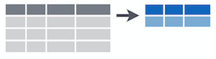

```{r setup, include=FALSE}
knitr::opts_chunk$set(echo = TRUE, rows.print = 5)

# suppress scientific notation
options(scipen = 999)

# load libraries
library(tidyverse)
library(janitor)
```


# **Purpose**

For further resources, check out [*R for Data Science*](https://r4ds.had.co.nz/){target="_blank"} by Hadley Wickham and [this cheatsheet on data wrangling](https://github.com/rstudio/cheatsheets/blob/master/data-transformation.pdf){target="_blank"} from RStudio.


Today's lab will cover:

1. [Intro to the tidyverse](#tidy)
1. [Manipulating observations](#obs)
1. [Manipulating variables](#vars)
1. [Summarizing data](#summarize)
1. [Grouping Data](#group)


***

# **Intro to the tidyverse**{#tidy}

The tidyverse, according to its creators, is ["an opionated collection of R packages designed for data science."](https://www.tidyverse.org/){target="_blank"} It's a suite of packages designed with a consistent philosophy and aesthetic. This is nice because all of the packages are designed to work well together, providing a consistent framework to do many of the most common tasks in R including, but not limited to:

* data cleaning (`tidyr`)
* data manipulation (`dplyr`)
* data visualization (`ggplot2`)
* working with strings (`stringr`)
* working with factors (`forcats`)

To load all the packages included in the tidyverse, use:

```{r eval=FALSE}
# if tidverse is not installed first use `install.packages("tidyverse")`
library(tidyverse)
```


Today we'll mostly focus on data manipulation with `dplyr`.

Three qualities of the `tidyverse` are worth mentioning at the outset:

1. Packages are designed to be like *grammars* for their task, so we'll be using terms like verbs to discuss the tidyverse. The idea is that you can string these grammatical elements together to form more complex statements, just like with language. 

2. The first argument of (basically) every function is `data`. This is very handy, especially when it comes to piping (discussed below).

3. Variable names are *usually* not quoted.

## What is data wrangling?

Data wrangling, broadly speaking, means getting your data into a useful form for visualizing and modelling it. Hadley Wickham, who has developed a lot of the tidyverse, conceptualizes the main steps involved in data wrangling as follows:

1. Importing your data (we covered this in [Week 1's lab](https://uopsych.github.io/psy611/labs/lab-1.html#importing_data_into_r){target="_blank"})
2. Tidying your data (see brief overview below)
3. Transforming your data (what we'll cover today)

The figure below highlights the steps in data wrangling in relation to the broader model of a typical data science workflow:

<center>

</center>

## What is tidy data?

Data is considered "tidy" when:

1. Each variable has its own column
2. Each observation has its own row
3. Each value has its own cell

The following figure from *R for Data Science* illustrates this visually. 

<center>

</center>

If your data is not in tidy format already when you import it, the `tidyR` package contains functions, e.g. `gather()` and `spread()`, that allow you to "reshape" your data to get it into tidy format. 

However, this term we are mostly going to work with simpler datasets that are already tidy, so we are not going to focus on these functions today. These functions will become especially useful in the future when we work with repeated measures data that has multiple observations for each subject. If you are interested in learning more about reshaping your data with `tidyR`, check out [this chapter](https://r4ds.had.co.nz/tidy-data.html#introduction-6){target="_blank"} from *R for Data Science*.

## Today's focus: `{dplyr}`

Most of the functions we'll go over today come from the `{dplyr}` package. Essentially, you can think of this package as a set of "pliers" that you can use to tweak data frames, hence its name (and hex sticker).

<center>

</center>

`{dplyr}` is a "grammar" of data manipulation. As such, its functions are *verbs*:

* `mutate()` adds new variables that are functions of existing variables
* `select()` picks variables based on their names.
* `filter()` picks cases based on their values.
* `summarise()` reduces multiple values down to a single summary.
* `arrange()` changes the ordering of the rows.

## Pipes

Pipes come from the `{magrittr}` package are available when you load the tidyverse. (The pipe is technically imported with `{dplyr}`.) Pipes are a way to write strings of functions more easily, creating *pipelines*. They are extremely powerful and useful. A pipe looks like this:

`%>%`

You can enter a pipe with the shortcut `CTRL+Shift+M` for PC or `CMD+Shift+M` for Mac.

Strictly speaking, a pipe passes an object on the left-hand side as the first argument (or `.` argument) of whatever function is on the right-hand side.

* `x %>% f(y)` is the same as `f(x, y)`

* `y %>% f(x, ., z)` is the same as `f(x, y, z )`

For example, to calculate the mean of the `mpg` variable from the `mtcars` dataset and round our answer to 2 decimal places, we can do the following...

```{r}
mtcars$mpg %>% 
  mean(na.rm = TRUE) %>% 
  round(2)
```

This accomplishes the same thing as "nesting" functions within each other...

```{r}
round(mean(mtcars$mpg, na.rm = TRUE), 2)
```

### Why use pipes?

1. Cleaner code
    * This is nice, because it helps make your code more readable by other humans (including your future self). 

2. Cleaner environment
    * When you use pipes, you have basically no reason to save objects from intermediary steps in your data wrangling / analysis workflow, because you can just pass output from function to function without saving it.
    * Finding objects you're looking for is easier.

3. Efficiency in writing code
    * Naming objects is hard; piping means coming up with fewer names.
    
4. More error-proof
    * Because naming is hard, you might accidentally re-use a name and make an error.

## Example dataset

Because you are already familiar with the World Happiness dataset, we will use this as a running example today. You can import the data with the following code:

```{r}
world_happiness <- rio::import("https://raw.githubusercontent.com/uopsych/psy611/master/labs/resources/lab5/data/world_happiness.csv")
```

### Clean names

If we look at the names of the variables in `world_happiness`, we'll notice that all of the variable names are capitalized. 

```{r}
names(world_happiness)
```

Personally, I find it annoying to have to remember to capitalize the first letter whenever I reference a variable name. The `clean_names()` from the `{janitor}` package will (by default) convert all variable names to `snake_case` (but there are several other options...see [here](https://cran.r-project.org/web/packages/janitor/vignettes/janitor.html#clean-data.frame-names-with-clean_names){target="_blank"} for more info).

```{r eval=FALSE}
install.packages("janitor") # if not already installed
library(janitor)
```

```{r}
# clean variable names
world_happiness <- world_happiness %>% 
  clean_names()
```

Now all of our variable names are lower case. 

**Note**: Remember to save your new data frame to an object of the same name as your old data frame if you want to overwrite the old one. 

```{r}
names(world_happiness)
```

***

# **Manipulating observations**{#obs}

## Extract rows with `filter()`


```{r}
world_happiness %>% 
  filter(country == "United States")
```

## Logical operators


## Sort rows with `arrange()`


* Sort countries by happiness

```{r}
world_happiness %>% 
  arrange(happiness) # sorts in ascending order by default

world_happiness %>% 
  arrange(desc(happiness)) # sort in descending order
```

***

# **Manipulating variables**{#vars}

## Extract columns with `select()`

* Select one variable

```{r}
# select using variable name
world_happiness %>% 
  select(country)
```

```{r}
# select using variable position
world_happiness %>% 
  select(1)
```


* Select multiple variables

```{r}
# select using variable names
world_happiness %>% 
  select(country, freedom, corruption)
```


```{r}
# select using variable positions
world_happiness %>% 
  select(1, 6, 8)
```

* Select a range of variables

```{r}
world_happiness %>% 
  select(country:support)
```

* Rearrange the order of variables
  + Note: `everything()` is a helper function that gives us all the remaining varaibles in the data frame (see more on helper functions below)

```{r}
world_happiness %>% 
  select(country, world, everything()) 
```

* De-select variables with a minus sign (`-`)

```{r}
world_happiness %>% 
  select(-happiness)
```

* De-select range of variables

```{r}
world_happiness %>% 
  select(-(gdp:world))
```


## Helper functions for `select()`

There are some "helper" functions that you can use along with `select()` if it is easier or more efficient to use certain criteria instead of selecting your variables by name. 

function | what it does
---------|-------------
`starts_with()` | selects columns starting with a string
`ends_with()` | selects columns that end with a string
`contains()` | selects columns that contain a string
`matches()` | selects columns that match a regular expression
`num_ranges()` | selects columns that match a numerical range
`one_of()` | selects columns whose names match entries in a character vector
`everything()` | selects all columns
`last_col()` | selects last column; can include an offset.

Quick example:

```{r}
world_happiness %>% 
  select(starts_with("c")) 
```

## Make new variables with `mutate()`

* Create a new variable 
  + Note: New variables are added at the end of the data frame (scroll to the right to see it)

```{r}
world_happiness %>% 
  mutate(corruption_std = scale(corruption)) # calculate z-score
```

* Change variable type

```{r}
class(world_happiness$world)

# Note that I am re-saving the dataframe here to preserve this change
world_happiness <- world_happiness %>% 
  mutate(world = as.factor(world))
```

Now check the type again...

```{r}
class(world_happiness$world)
```


***

# **Summarizing data**{#summarize}

* The next dplyr verb we’ll cover is `summarize()`, which is used to summarize across rows of a dataset. `summarize()`, like all tidyverse functions, requires data as its first argument, and then you enter your summary functions separated by commas. Summary functions take vectors as inputs and return single values as outputs:

<center>

</center>


* The resulting dataset will have just the variables you summarized and will lose everything else. In other words, you are going from your raw data frame to a smaller summary data frame that only contains the summary variables you specify within `summarize()`.

<center>

</center>

* Just like with `mutate()`, each expression is `new_var_name = EXPRESSION`. Let's use `summarize()` to get the mean of `gdp` across all observations in the dataset. 

```{r}
world_happiness %>% 
  summarize(mean_gdp = mean(gdp, na.rm = TRUE))
```

* Of course, we typically want to calculate more than just a mean. We can add other summary variables, separating them by commas. 

```{r}
world_happiness %>% 
  summarize(mean_gdp = mean(gdp, na.rm = TRUE), # mean
            sd_gdp = sd(gdp, na.rm = TRUE), # standard deviation
            n = n()) # number of observations
```

* For a list of other common summary functions, check out the [cheat sheet](https://github.com/rstudio/cheatsheets/blob/master/data-transformation.pdf){target="_blank"}. 

*** 

# **Grouping data**{#group}

`group_by()` creates groups based on one or more variables in the data. This affects all kinds of things that you then do with the data, such as mutating and/or summarizing. It is pretty simple to use. It requires data as its first argument, and the you name the variable(s) to group by.

```{r}
world_happiness %>% 
  group_by(world)
```

At first glance, it doesn't appear that anything has happened. However, copy and paste this code into the console. What do you notice?

## Apply to `summarize()`

## Apply to `mutate()`

***

# **Minihacks**

## Minihack 1:

## Minihack 2:

## Minihack 3: