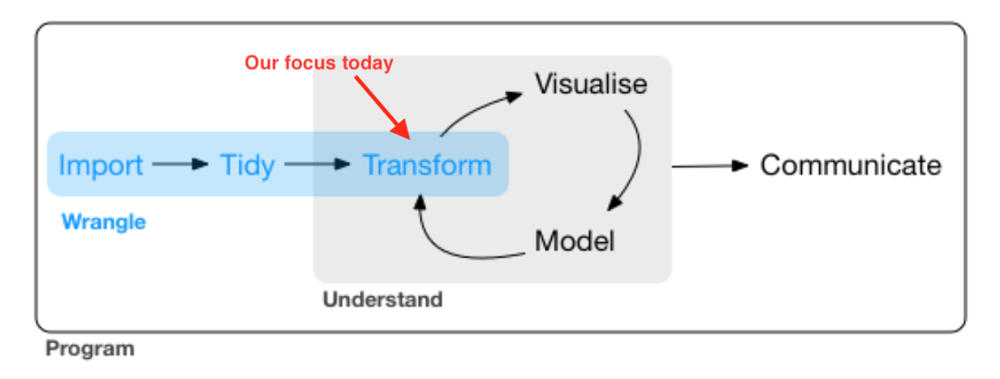
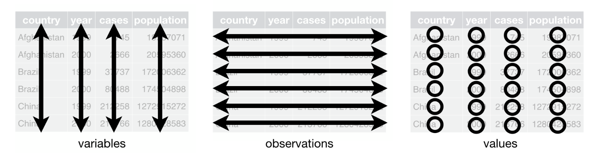

```{r setup, include=FALSE}
knitr::opts_chunk$set(echo = TRUE)

# suppress scientific notation
options(scipen = 999)
```


# **Purpose**

For further resources, check out [*R for Data Science*](https://r4ds.had.co.nz/){target="_blank"} by Hadley Wickham and [this cheatsheet on data wrangling](https://rstudio.com/wp-content/uploads/2015/02/data-wrangling-cheatsheet.pdf){target="_blank"} from RStudio.


Today's lab will cover:

1. [Intro to the tidyverse](#tidy)
1. [Manipulating observations](#obs)
1. [Manipulating variables](#vars)
1. [Summarizing data](#summarize)
1. [Grouping Data](#group)


***

# **Intro to the tidyverse**{#tidy}

The tidyverse, according to its creators, is ["an opionated collection of R packages designed for data science."](https://www.tidyverse.org/){target="_blank"} It's a suite of packages designed with a consistent philosophy and aesthetic. This is nice because all of the packages are designed to work well together, providing a consistent framework to do many of the most common tasks in R including, but not limited to:

* data cleaning (`tidyr`)
* data manipulation (`dplyr`)
* data visualization (`ggplot2`)
* working with strings (`stringr`)
* working with factors (`forcats`)

Today we'll mostly focus on data manipulation with `dplyr`.

Three qualities of the `tidyverse` are worth mentioning at the outset:

1. Packages are designed to be like *grammars* for their task, so we'll be using terms like verbs to discuss the tidyverse. The idea is that you can string these grammatical elements together to form more complex statements, just like with language. 

2. The first argument of (basically) every function is `data`. This is very handy, especially when it comes to piping (discussed below).

3. Variable names are *usually* not quoted.

## What is data wrangling?

Data wrangling, broadly speaking, means getting your data into a useful form for visualizing and statistical modelling. Hadley Wickham, who has developed a lot of the tidyverse, conceptualizes the main steps involved in data wrangling as follows:

1. Importing your data (we covered this in [Week 1's lab](https://uopsych.github.io/psy611/labs/lab-1.html#importing_data_into_r){target="_blank"})
2. Tidying your data (see brief overview below)
3. Transforming your data (what we'll cover today)

The figure below highlights the steps in data wrangling in relation to the broader model of a typical data science workflow:

<center>

</center>

## What is tidy data?

Data is considered "tidy" when:

1. Each variable has its own column
2. Each observation has its own row
3. Each value has its own cell

The following figure from *R for Data Science* illustrates this visually. 

<center>

</center>

If your data is not in tidy format already when you import it, the `tidyR` package contains functions, e.g. `gather()` and `spread()`, that allow you to "reshape" your data to get it into tidy format. 

However, this term we are mostly going to work with simpler datasets that are already tidy, so we are not going to focus on these functions today. These functions will become especially useful in the future when we work with repeated measures data that has multiple observations for each subject. If you are interested in learning more about reshaping your data with `tidyR`, check out [this chapter](https://r4ds.had.co.nz/tidy-data.html#introduction-6){target="_blank"} from *R for Data Science*.

## Today's focus: `{dplyr}`

***

# **Manipulating observations**{#obs}

## Extract rows

## Logical operators

## Arrange rows

***

# **Manipulating variables**{#vars}

## Extract columns with `select()`

## Helper functions for `select()`

## Make new variables with `mutate()`

***

# **Summarizing data**{#summarize}

## Common summary functions

*** 

# **Grouping data**{#group}

## Apply to `summarize()`

## Apply to `mutate()`

***

# **Minihacks**

## Minihack 1:

## Minihack 2:

## Minihack 3: