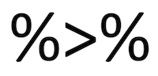

```{r setup, include=FALSE}
knitr::opts_chunk$set(echo = TRUE, rows.print = 5)

# suppress scientific notation
options(scipen = 999)

```


# Purpose

The purpose of today's lab is to introduce you to the `tidyverse`, which is a collection of packages designed for data science.  We will focus on data wrangling, including how to extract specific observations and variables, how to generate new variables, and how to summarize data. 

For further resources on these topics, check out [*R for Data Science*](https://r4ds.had.co.nz/){target="_blank"} by Hadley Wickham and [this cheatsheet on data wrangling](https://github.com/rstudio/cheatsheets/blob/master/data-transformation.pdf){target="_blank"} from RStudio.

***

# Intro to the tidyverse{#tidy}

* When you load the `tidyverse` using `library(tidyverse)`, you are actually loading several different packages that are designed to work well together and help you complete common tasks in R. Some of these packages are...

  + data manipulation (`dplyr`) **= our focus today**
  + reshaping data (`tidyr`)
  + data visualization (`ggplot2`)
  + working with strings (`stringr`)
  + working with factors (`forcats`)

Let's load the `tidyverse`:
```{r}
#install.packages("tidyverse")
library(tidyverse)
```

## Data wrangling with R

* Data wrangling means getting your data into a useful form for visualizing and modeling it. Before you analyze your data, you will need to clean and transform it. For example, you may want to remove a variable in your data set, or remove participants who do not fit a certain criteria. 

If you clean a dataset in excel or SPSS, you can end up deleting important information. When you clean and transform a dataset in R, R doesn't edit the underlying file. Rather, it edits the data frame in your global environment. 

## Today's focus: `{dplyr}`

* Most of the functions we'll go over today come from the `{dplyr}` package. Essentially, you can think of this package as a set of "pliers" that you can use to tweak data frames, hence its name.

* `{dplyr}` is a "grammar" of data manipulation. As such, its functions are *verbs*:

  + `mutate()` adds new column(s).
  
  + `select()` selects column(s).
  
  + `filter()` selects rows based on a criteria.
  
  + `summarize()` summarizes multiple selected values (useful for mean, sd, n).
  
  + `arrange()` changes the ordering of the rows.

## Pipes{#pipes}

* Pipes come from the `{magrittr}` package and are available when you load the tidyverse. Pipes are a way to write strings of functions more easily, creating *pipelines*. A pipe looks like this:

<center>

</center>

\n

  + You can enter a pipe with the shortcut `CTRL+Shift+M` for PC or `CMD+Shift+M` for Mac.
  
```{r, evaluate = FALSE}
#practice entering a pipe with the shortcut here

```


* A pipe passes an object on the left-hand side as the first argument (or `.` argument) of whatever function is on the right-hand side.

  + `x %>% f(y)` is the same as `f(x, y)`

  + `y %>% f(x, ., z)` is the same as `f(x, y, z )`

Example: I want to calculate the mean of the `mpg` variable from the `mtcars` data set and round our answer to 2 decimal places. I can accomplish this by nesting: 

```{r}
round(mean(mtcars$mpg, na.rm = TRUE), 2)
```

Or, we could use pipes. 

```{r}
#re-write the above code using pipes

```


### Why use pipes?

1. Cleaner code
    * This is nice, because it helps make your code more readable by other humans (including your future self). 
    
\n
2. Cleaner environment
    * When you use pipes, you don't have to save objects from intermediary steps in your global environment because you can just pass output from function to function without saving it.
    
\n    
3. Efficiency in writing code
    * Naming objects is hard; piping means coming up with fewer names.

\n
4. More error-proof
    * Because naming is hard, you might accidentally re-use a name and make an error.

## Example data set

* Because you are already familiar with the World Happiness data set, we will use this as a running example today (we'll use the same version from Homework 1). You can import the data with the following code:

```{r}
world_happiness <- rio::import("https://raw.githubusercontent.com/uopsych/psy611/master/labs/resources/lab5/data/world_happiness.csv")
```

### Clean names

* If we look at the names of the variables in `world_happiness`, we'll notice that all of the variable names are capitalized. 

```{r}
names(world_happiness)
```

* The `clean_names()` function from the `{janitor}` package will (by default) convert all variable names to `snake_case` (but there are several other options...see [here](https://cran.r-project.org/web/packages/janitor/vignettes/janitor.html#clean-data.frame-names-with-clean_names){target="_blank"} for more info).

```{r}
#install.packages("janitor")
library(janitor)
```

```{r}
# clean variable names and re-save the data
world_happiness <- world_happiness %>% 
  clean_names()
```

Now all of our variable names are lower case. 

```{r}
names(world_happiness)
```

**Note**: Remember to save your new data frame to an object of the same name as your old data frame if you want to overwrite the old one. 

***

# Manipulating observations{#obs}

## Select rows with `filter()`

* The `filter()` function is used to subset observations based on their values. The result of filtering is a data frame with the same number of columns as before but fewer rows.

* The first argument is `data` and subsequent arguments are logical expressions that tell you which observations to retain in the data frame. 

For example, you can filter rows to choose only rows from the United States.

```{r, evaluate = FALSE}
#complete the code to choose rows in which the country is the United States

# world_happiness %>% 
#    filter(?? == ??)
```

## Logical operators

* The `==` we just used is an example of a comparison operator that tests for equality. The other comparison operators available are :

  + `>` (greater than)
  + `>=` (greater than or equal to)
  + `<` (less than)
  + `<=` (less than or equal to)
  + `!=` (not equal to)

\n
* You can combine multiple arguments to `filter()` with Boolean operators. The figure below from [*R for Data Science*](https://r4ds.had.co.nz/transform.html#logical-operators){target="_blank"} shows the complete set of Boolean operators.

<center>

</center>

* For example, let's select the United States, Mexico and Canada.

```{r, evaluate = FALSE}
#complete the code to choose rows in which the country is the United States
# world_happiness %>% 
#   filter(??)
```

* Since it is somewhat cumbersome to write `country` three times, we can use a special short-hand here with the `%in%` operator. Generally speaking, specifying `x %in% y` will select every row where `x` is one of the values in `y`.

So we could have written our filter statement like this:

```{r eval = FALSE}
world_happiness %>% 
  filter(country %in% c("United States", "Mexico", "Canada"))
```


### You try

* Filter for observations that are greater than the mean of `happiness`

```{r}
# your code here
```

* Filter for observations that are greater than the mean of `happiness` but less than the mean of `gdp`

```{r}
# your code here
```


## Sort rows with `arrange()`

* The `arrange()` function keeps the same number of rows but changes the *order* of the rows in your data frame, as illustrated below...

<center>

</center>

* The first argument is `data` and subsequent arguments are name(s) of columns to order the rows by. If you provide more than one column name, each additional column will be used to break ties in the values of preceding columns.

For example, let's re-order observations by `happiness`. Note that rows are sorted in ascending order by default.

```{r}
world_happiness %>% 
  arrange(happiness) # sorts in ascending order by default

world_happiness %>% 
  arrange(desc(happiness)) # sort in descending order
```

***

# Manipulating variables{#vars}

## Extract columns with `select()`

* The `select()` function subsets columns in your data frame. This is particularly useful when you have a data set with a huge number of variables and you want to narrow down to the variables that are relevant for your analysis. 

<center>

</center>


* The first argument is `data`, followed by the name(s) of the column(s) you want to subset. Note that you can use variable positions rather than their names, but this is usually not as useful. Let's go through some simple examples of common uses of `select()`.

* Select one variable

```{r}
world_happiness %>% 
  select(country)
```

* Select multiple variables

```{r}
world_happiness %>% 
  select(country, freedom, corruption)
```

* Select a range of variables

```{r}
world_happiness %>% 
  select(country:support)
```

* Rearrange the order of variables
  + Note: `everything()` is a helper function that gives us all the remaining variables in the data frame (see more on [helper functions](#helper) below)

```{r}
world_happiness %>% 
  select(country, world, everything()) 
```

* De-select variables with a minus sign (`-`)

```{r}
world_happiness %>% 
  select(-happiness)
```

* De-select range of variables

```{r}
world_happiness %>% 
  select(-(gdp:world))
```

### You try

* Produce a data frame that has only countries coded as `1` that have greater than average levels of freedom. Arrange the rows by `freedom` scores in descending order, and only display the `country` and `freedom` variables (in that order). How many observations are you left with?

```{r}
# your code here
```


### Helper functions for `select()` {#helper}

There are some "helper" functions that you can use along with `select()` that can sometimes be more efficient than selecting your variables explicitly by name. 

function | what it does
---------|-------------
`starts_with()` | selects columns starting with a string
`ends_with()` | selects columns that end with a string
`contains()` | selects columns that contain a string
`matches()` | selects columns that match a regular expression
`num_ranges()` | selects columns that match a numerical range
`one_of()` | selects columns whose names match entries in a character vector
`everything()` | selects all columns
`last_col()` | selects last column; can include an offset.

Quick example:

```{r}
world_happiness %>% 
  select(starts_with("c")) 
```

## Make new variables with `mutate()`

* The `mutate()` function is most commonly used to add new columns to your data frame that are functions of existing columns.

<center>

</center>

* `mutate()` requires data as its first argument, followed by a set of expressions defining new columns. Let's take a couple examples...

* Create new variables
  + **Note**: New variables are automatically added at the end of the data frame (scroll to the right to see them)

```{r}
world_happiness %>% 
  mutate(corruption_z = scale(corruption), # z-score `corruption` variable
         life_int = round(life, 0)) # round `life` variable to a whole number
```

* Change existing variables

When we imported our data, the `world` variable was automatically categorized as an `integer`.

```{r}
class(world_happiness$world)
```

However, this variable refers to discrete categories, and we want to change it to be a `factor`. We can do this using `mutate()`.

```{r}
# Note that I am re-saving the dataframe here to preserve this change
world_happiness <- world_happiness %>% 
  mutate(world = as.factor(world))
```

Now check the type again...

```{r}
class(world_happiness$world)
```

***

# Summarizing data{#summarize}

* The next dplyr verb we’ll cover is `summarize()`, which is used to summarize across rows of a data set. Like all tidyverse functions, `summarize()` requires `data` as its first argument, and then you enter your summary functions separated by commas. Summary functions take vectors as inputs and return single values as outputs:

<center>

</center>


* The resulting data set will have just the summary variables you created and will lose everything else. In other words, you are going from your raw data frame to a smaller summary data frame that only contains the summary variables you specify within `summarize()`, as illustrated below...

<center>

</center>

Let's use `summarize()` to get the mean of `gdp` across all observations in the data set. 

```{r}
world_happiness %>% 
  summarize(mean_gdp = mean(gdp, na.rm = TRUE))
```

* Of course, we typically want to calculate more than just a mean. We can add other summary variables, separating them by commas. 

```{r}
world_happiness %>% 
  summarize(mean_gdp = mean(gdp, na.rm = TRUE), # mean
            sd_gdp = sd(gdp, na.rm = TRUE), # standard deviation
            n = n()) # number of observations
```

* For a list of other common summary functions, check out the [cheat sheet](https://github.com/rstudio/cheatsheets/blob/master/data-transformation.pdf){target="_blank"}. 

*** 

# Grouping data{#group}

* The `group_by()` function creates groups based on one or more variables in the data. This affects all kinds of things that you then do with the data, such as mutating and/or summarizing. `group_by()` requires `data` as its first argument, and the you name the variable(s) to group by.

<center>

</center>

```{r}
world_happiness %>% 
  group_by(world)
```

At first glance, it doesn't appear that anything has happened. However, under the hood it has indeed grouped the data frame by the `world` variable. Copy and paste this code into the console--what do you notice?

## Combining `group_by()` and `summarize()`

* `group_by()` and `summarize()` can be combined to get group-level statistics. This is a great way to make tables of descriptive stats in R or to create aggregated data sets for some purposes.

<center>

</center>

* To use these together, you just run `group_by()` followed by `summarize()` in a pipeline.

```{r}
world_happiness %>% 
  group_by(world) %>% # group by the world variable
  summarize(mean_gdp = mean(gdp, na.rm = TRUE), # mean
            sd_gdp = sd(gdp, na.rm = TRUE), # standard deviation
            n = n()) # number of observations
```

***

# Minihacks

For the minihacks today, we will be working with the [`diamonds`](https://ggplot2.tidyverse.org/reference/diamonds.html){target="_blank"} data set, which is built into R. This data set contains the prices and various other attributes of about 54,000 different diamonds. Take a peek at the data set with the following functions:

```{r, eval=FALSE}
head(diamonds) # first few rows
str(diamonds) # structure of the data frame
```

Here are what the variables refer to:

variable | meaning
---------|--------
`price` | price in US dollars 
`carat` | weight of the diamond
`cut` | quality of the cut (Fair, Good, Very Good, Premium, Ideal)
`color` | diamond colour, from D (best) to J (worst)
`clarity` | a measurement of how clear the diamond is (I1 (worst), SI2, SI1, VS2, VS1, VVS2, VVS1, IF (best))
`x` | length in mm 
`y` | width in mm 
`z` | depth in mm 
`depth` | total depth percentage 
`table` | width of top of diamond relative to widest point

## Minihack 1: Make code more legible

1. Take a look at the following chunk of code. If you're like me, this will make your head hurt. See if you can understand what this code is trying to do. 

```{r eval = FALSE}
arrange(select(filter(diamonds, carat > 3 & carat < 4, cut == "Premium", color == "G" |  color == "H" | color == "I" | color == "J"), carat, color, price), color, desc(price))
```

2. Re-write this code using pipes (` %>% `) so it is easier to read. Make sure you get the same result that you get when you run the above code. For an extra challenge, try making the filtering step a little more concise.

```{r}
# your code here
```


## Minihack 2: Translating into `{dplyr}` verbs

Answer the questions below using functions from `{dplyr}`. Think about the order in which you will need to do different operations.

1. What is the difference in average carat size between `Fair` and `Ideal` diamonds?

```{r}
# your code here
```


2. Which is more expensive on average, a diamond that is `Fair` and `IF` (worst cut, best clarity), or a diamond that is `Ideal` and `I1`(best cut, worst clarity)?

```{r}
# your code here
```

## Minihack 3: Summarizing data

1. Calculate the summary statistics listed below for the `carat` variable for each `color` of diamond. Give your summary variables the names indicated in parentheses.

  * mean (`mean`)
  * standard deviation (`sd`)
  * number of observations (`n`)
  * standard error of the mean (`sem`)
  * 95% confidence interval (lower and upper bounds) around the mean (calculated using a *t* distribution). (`ci_lower` and `ci_upper`)
    + Hint: Refer to [this slide from class](https://uopsych.github.io/psy611/lectures/9-sampling.html#40){target="_blank"} for an example
    
  ***In your final summary output only include `color`, `mean`, `ci_lower` and `ci_upper`
  
```{r}
# your code here
```
  

2. Repeat the same process above, but this time calculate summary statistics for the `carat` variable for each combination of `color` and `cut`. How many observations do you have in your summary data frame this time?

```{r}
# your code here
```


* If your data is not already in tidy format when you import it, you can use functions from the `{tidyR}` package, e.g. `gather()` and `spread()`, that allow you to "reshape" your data to get it into tidy format.However, this term we are mostly going to work with simpler data sets that are already tidy, so we are not going to focus on these functions today. These functions will become especially useful in the future when we work with repeated measures data that has multiple observations for each subject. If you are interested in learning more about reshaping your data with `{tidyR}`, check out [this chapter](https://r4ds.had.co.nz/tidy-data.html#introduction-6){target="_blank"} from *R for Data Science*.