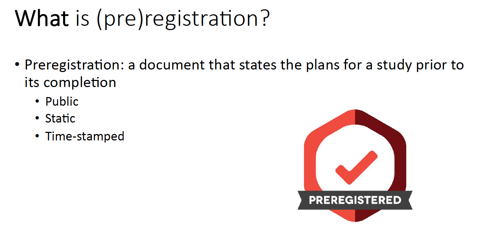
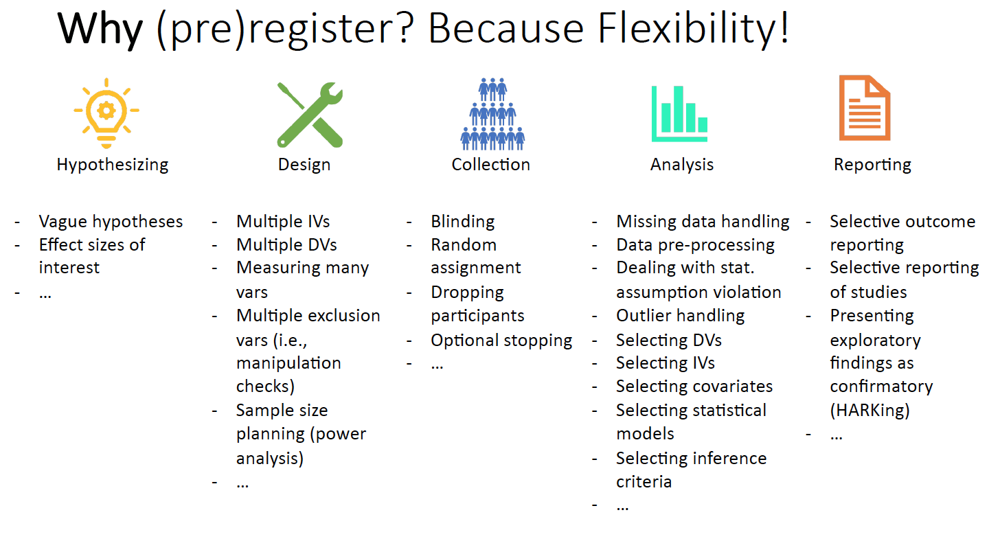
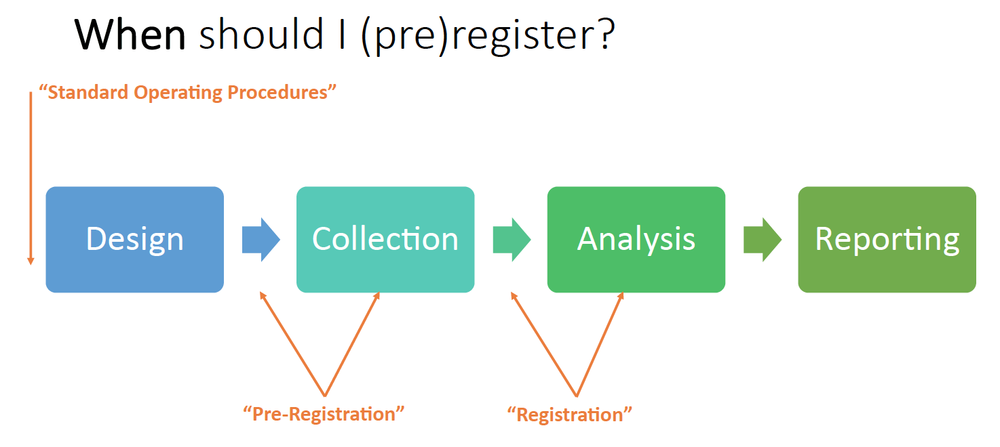
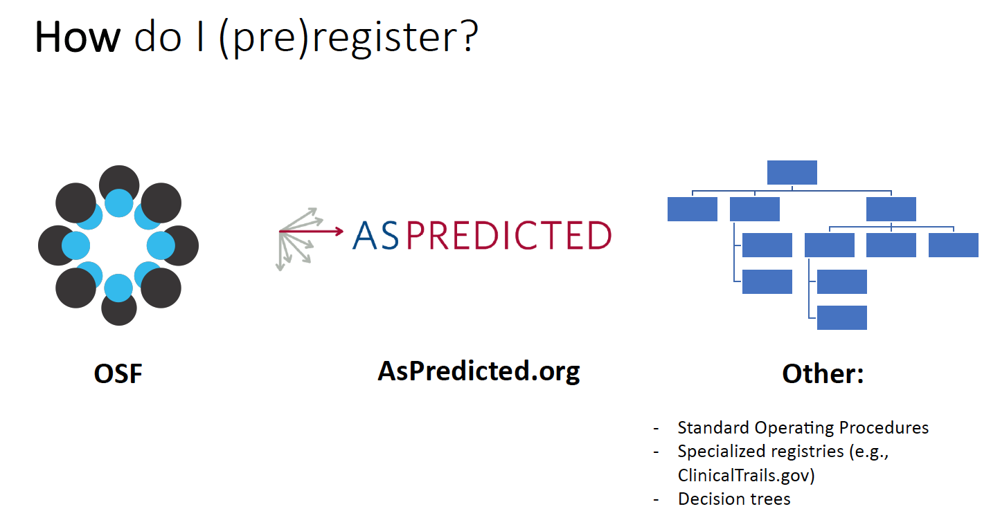
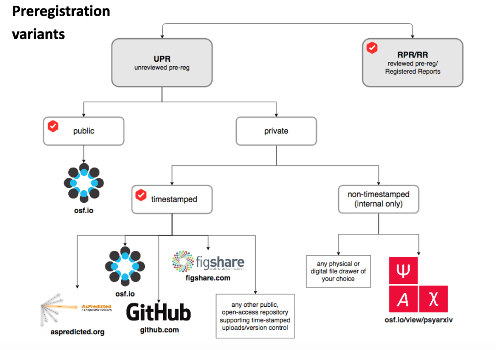
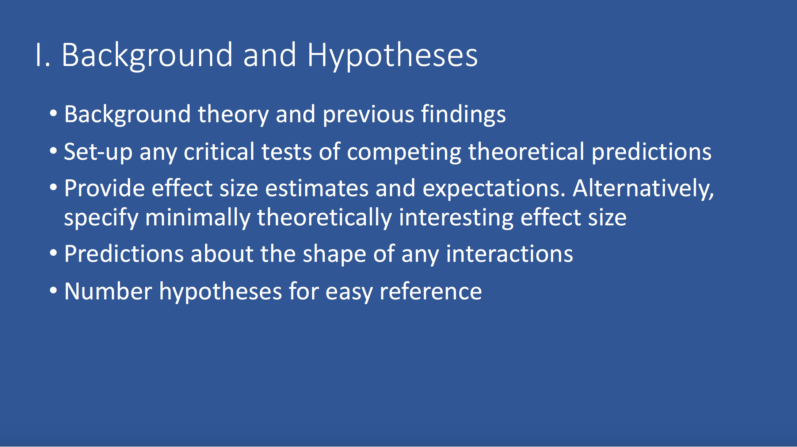
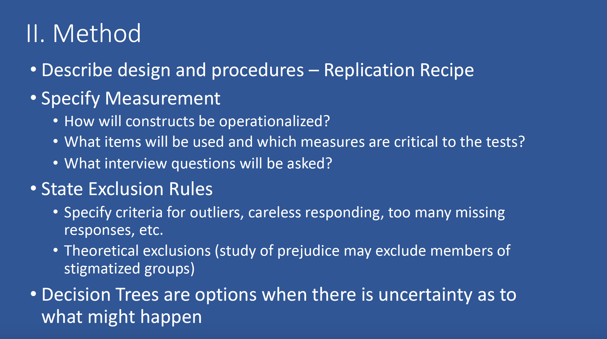
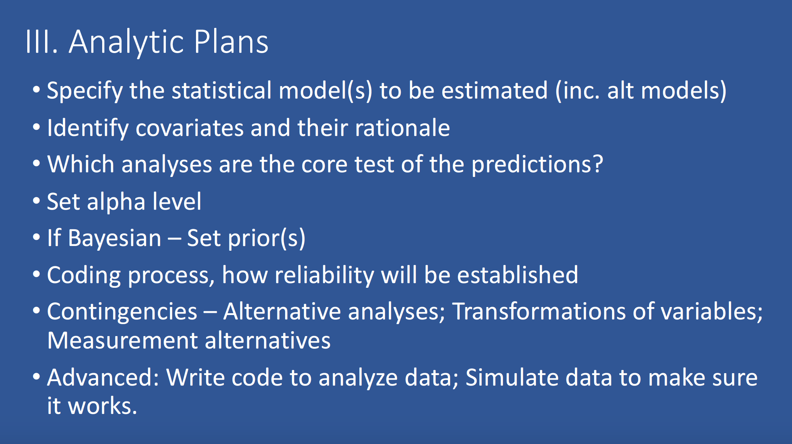
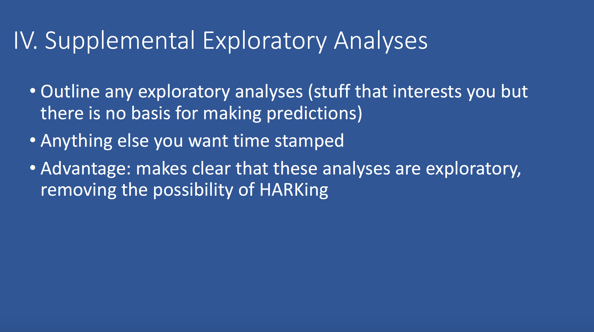

# Purpose

The purpose of today's lab is to walk through how to create a pre-registration on the [Open Science Framework](https://osf.io){target="_blank"}. Rather than serve as a step-by-step tutorial, this page will mostly contain links to other resources on pre-registration and open science that you can use when drafting your own preregistrations, along with a few questions/prompts to guide our discussion. 

*Note:* A lot of the material in this document has been copied (or adapted) from pregistration workshops by Moin Syed (https://osf.io/pm8bh/) and Cassie Brandes (https://osf.io/pm8bh/). 

***

# Overview of preregistration {.tabset .tabset-fade .tabset-pills}

## What? 

## Why?

## When? 

## How?

***
# Types of preregistration

Source: https://osf.io/t4p9g/

***

# Group exercise: "Find the flexibility"

[Click here.](https://mfr.osf.io/render?url=https://osf.io/y8f4c/?action=download%26mode=render){target="blank"}

***

# Components of a pregistration {.tabset .tabset-fade .tabset-pills}

## Background

## Method

## Analysis Plan

## Exploratory Analysis

***
# Example preregistration

[Click here.](https://osf.io/4qut8){target="_blank"}

***

# Walk through OSF

[Link to OSF](https://osf.io){target="_blank"}

[How to create a pre-registration on OSF](https://help.osf.io/hc/en-us/articles/360019738834-Create-a-Preregistration){target="_blank"}

***

# FAQ
Sources: [OSF Slide Decks](https://osf.io/t4p9g/){target="_blank"}; [Association for Psychological Science](https://www.psychologicalscience.org/observer/research-preregistration-101#.WD_Dz5K5Ll5){target="_blank"}

## 1. What do I need to do when writing up my preregistered study?

* Include a link to your preregistration
* Report results of *all* pre-registered analyses
* Any unregistered analyses must be transparent 

See [here](https://mfr.osf.io/render?url=https://osf.io/zwkqj/?action=download%26mode=render){target="_blank"} and [here](https://mfr.osf.io/render?url=https://osf.io/3k7hf/?action=download%26mode=render){target="_blank"} for more resources from the Center for Open Science on what to include when reporting the results of preregistered research.

## 2. What if I need to change my research plan? 

* If you decide to make changes to your analysis plan *after* looking at your data/results, be sure to still report what you said what you were originally going to do, and you can still report your unplanned analyses, but you must indicate that these were unplanned. 

* If you decide to make changes *before* seeing your data, you can withdraw your original preregistration and create a new plan.

## 3. Can't someone "scoop" my ideas?

* Date-stamped preregistrations make your claim verifiable
* By the time you’ve preregistered, you are ahead of any possible scooper.
* Embargo your preregistration

## 4. Isn't it easy to cheat?

e.g. Making a “preregistration” after conducting the study; Making multiple preregistrations and only citing the one that “worked.”

* While fairly easy to do, this makes fraud more intentional. Preregistration helps keep you honest to *yourself*

* Preregistration does not assume dishonesty. HARKing and similar practices that preregistration cures typically are unintentional rather than deliberate. Preregistration helps us remember (and show others) what we actually planned.

## 5. Isn't preregistration a ton of extra work?

* Preregistration certainly involves an investment of time "up front", but it can save you time later on when writing your manuscript.
* Basically, once you have written a preregistration, you will have written most of the methods section. 
* Sharing your preregistration and study materials openly will make it easier for others (or yourself) to reproduce your work later on. 

***

# Any questions/concerns?

***

# Resources

* [Video tutorial](https://www.youtube.com/watch?v=EnKkGO3OM9c&feature=emb_title){target="_blank"} on pre-registration from the Center for Open Science

* [OSF preregistration templates](https://osf.io/zab38/){target="_blank"}

* [Preregistration: A Plan, Not a Prison](https://cos.io/blog/preregistration-plan-not-prison/){target="_blank"}

* [Pregistration workshop](https://osf.io/fkt8e/){target="_blank"} (2017) from the Society for Improving Psychological Science (SIPS). Slides [here](https://docs.google.com/presentation/d/1MJ-kqfSzd34iO9dW5saRLHW1xq3n2Tgm_18K4uTvdfY/edit#slide=id.p){target="_blank"}

* [A whole bunch of resources](https://mfr.osf.io/render?url=https://osf.io/v6mxc/?action=download%26mode=render){target="_blank"} curated by M. Brent Donnellan and Moin Syed
