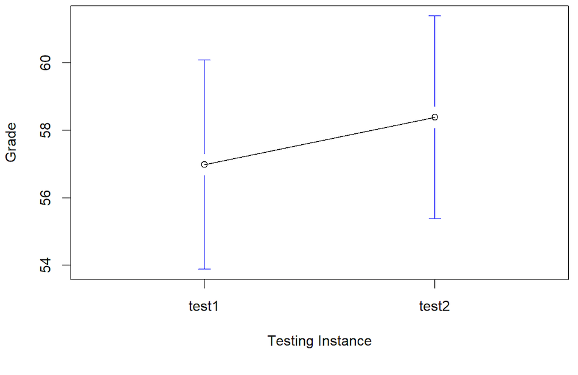
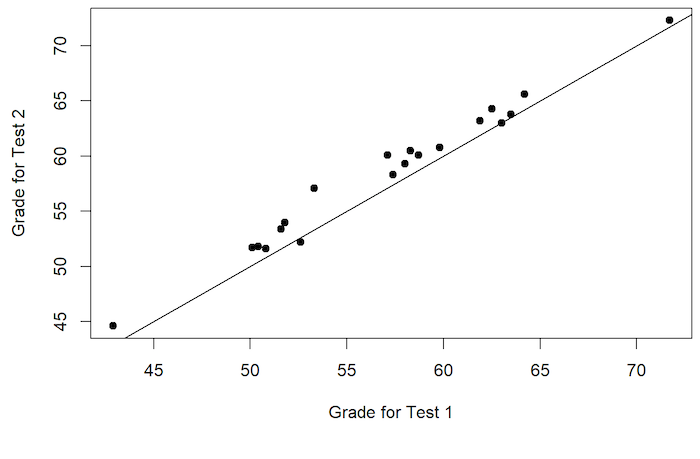
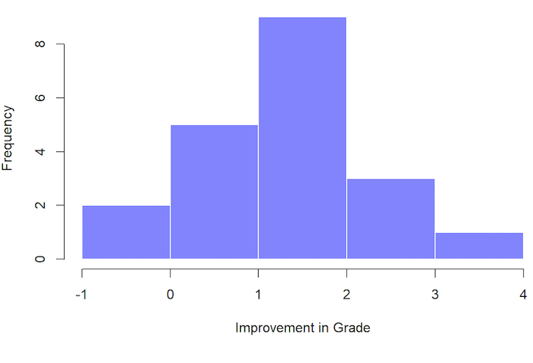

```{r setup, include = FALSE}
# set chunk options
knitr::opts_chunk$set(message = FALSE,
                      warning = FALSE)

# suppress scientific notation
options(scipen = 999)

#load required packages for .Rmd set-up
library(here) # for finding paths
```

# Purpose

Today's lab will guide you through the process of conducting a paired samples *t*-test. As we did with [one-sample and independent samples *t*-tests](https://uopsych.github.io/psy611/labs/lab-8.html){target="_blank"}, we will first cover how to a conduct a paired samples *t*-test by hand. Then we will use functions from the `{stats}` and `{lsr}` packages to conduct the analysis. We will also discuss how to interpret the results and plot the data using `{ggpubr}`. At the end of today's lab, you will be asked to apply what you learned to a new data set in the [minihacks](#minihacks).

To quickly navigate to the desired section, click one of the following links:

1. [The Data](#data)
1. [Data exploration](#explore)
1. [What is a paired samples *t*-test?](#paired)
1. [Paired samples *t*-test using arithmetic](#arith)
1. [Paired samples *t*-test using functions](#func)
1. [Interpreting paired samples *t*-tests](#interp)
1. [Plotting paired samples data](#plot)
1. [Minihacks](#minihacks)


* You will need several packages to be loaded in order to follow along. Go ahead and load them now by running the following code (and be sure to install any packages that you don't already have installed):

```{r}
#load required packages
library(tidyverse) # includes dplyr and ggplot2 functions
library(lsr) # includes t-test functions
library(stats) # includes different t-test functions
library(ggpubr) # for plotting
library(rio) # for importing data
library(psych) # for descriptives
library(pwr) # for conducting a power analysis
```

***

# The Data {#data}

To illustrate how paired-samples *t*-tests work, we are going to walk through [an example from your textbook](https://learningstatisticswithr-bookdown.netlify.com/ttest.html#pairedsamplesttest){target="_blank"}. In this example, the data comes from Dr. Chico's introductory statistics class. Students in the class take two tests over the course of the semester. Dr. Chico gives notoriously difficult exams with the intention of motivating her students to work hard in the class and thus learn as much as possible. Dr. Chico's theory is that the first test will serve as a "wake up call" for her students, such that when they realize how difficult the class actually is they will be motivated to study harder and earn a higher grade on the second test than they got on the first test.

You can load in the data from this example by running the following code:

```{r}
# wide format
chico_wide <- import("https://raw.githubusercontent.com/uopsych/psy611/master/labs/resources/lab9/data/chico_wide.csv")

# long format
chico_long <- import("https://raw.githubusercontent.com/uopsych/psy611/master/labs/resources/lab9/data/chico_long.csv")
```

**Note:** You should now have 2 versions of the same data set loaded into your global environment. The only difference in these versions of the data is their "shape" -- one is "wide" and the other is "long". In the wide form, every row corresponds to a unique *person*; in the long form, every row corresponds to a unique *observation* or *measurement*.

* To get a sense of the differences between these two versions of the data, see below:

```{r}
head(chico_wide)

head(chico_long)
```

* For now, we are going to work with `chico_wide`. Later on in the lab we will discuss more about how to deal with data that is in long format.

***

# Data exploration {#explore}

Let's take a closer look at the data before we actually run a *t*-test to see what might be going on...

```{r}
describe(chico_wide)
```

**Question:** What do you notice about the means of the two groups? Can we conclude anything?

* What if we look at the data graphically? 

<center>

</center>

* Based on the descriptive statistics and the plot above with widely overlapping confidence intervals, it might seem intuitive to think that the improvement in test scores from Test 1 to Test 2 is due entirely to chance. However, if we look at the data in a different way, we will see why this impression may not be correct...

<center>

</center>

**Question**: What do you notice about the pattern of points in this plot?

* Let's create a new variable to represent the *improvement* for each student from Test 1 to Test 2.

```{r}
chico_wide <- chico_wide %>% 
  mutate(diff = grade_test2 - grade_test1)

head(chico_wide)
```

* Now let's look at a histogram of these improvement scores:

<center>

</center>

* Notice that the vast majority of students have an improvement score above 0; in other words, virtually all students improved their score to some extent from Test 1 to Test 2. 

***

# What is a paired samples *t*-test? {#paired}

* In our example above, we created a new variable, `chico_wide$diff`, that represents the *difference* between each student's score on Test 1 and Test 2. 

* More generally, if $X_{i1}$ is the score that the $i$-th participant obtained on the first variable, and $X_{i2}$ is the score that the same person obtained on the second one, then the difference score is:

$$ \Delta_i = X_{i1} - X_{i2}$$

* The population mean of difference scores could be represented as:

$$ \mu_\Delta = \mu_1  - \mu_2$$ 

* Fundamentally, paired samples *t*-tests operate at the level of difference scores. Accordingly, we can state the null and alternative hypotheses for a paired-samples *t*-test as follows:

$$ H_0: \mu_\Delta = 0 $$ 
$$ H_1: \mu_\Delta \neq 0 $$ 

* So far this looks really similar to a one-sample *t*-test; in this case, we are testing whether the mean of some set of difference scores is different from 0. As such, our *t*-statistics for a paired samples *t*-test looks similar to what we have already learned for a one-sample *t*-test:

$$t = \frac{\bar \Delta}{\hat \sigma_\Delta / \sqrt{N}}$$

# Using arithmetic {#arith}

For running a paired *t*-test by hand, we essentially run a one-sample *t*-test. The main difference is that our mean and standard deviation are the mean and standard deviation of the difference scores.  

```{r}
# calculate mean and sd
chico_mean   <- mean(chico_wide$diff)
chico_sd     <- sd(chico_wide$diff)

# print the mean and sd
c("mean" = chico_mean,
  "sd"   = chico_sd)

```

As discussed in class, we can also calculate the standard deviation of the difference scores with the standard deviations of both groups by using the following equation:

$$\sqrt{\hat\sigma_{M1}^2 + \hat\sigma_{M2}^2 - 2r(\hat\sigma_{M1}\hat\sigma_{M2})}$$

```{r}
# calculate standard deviation of both groups
g1_sd <- sd(chico_wide$grade_test1)
g2_sd <- sd(chico_wide$grade_test2)

# calculate the correlation of both groups
g_cor <- cor(chico_wide$grade_test1, chico_wide$grade_test2)

# calculate the standard deviation
chico_sd_alt <- sqrt(g1_sd^2 + g2_sd^2 - (2 * g_cor * (g1_sd * g2_sd)))

# print the sd calculated using the alternative method
c("sd" = chico_sd_alt)
```

Both methods should produce the same value for the standard deviation of the difference scores. 

Next we can calculate the sample size and the degrees of freedom for our test. Keep in mind that our sample size is not the total number of observations (`40`). Instead, it is the total number of participants (`20`).

```{r}
# calculate sample size and degrees of freedom
chico_n      <- length(chico_wide$diff)
chico_df     <- chico_n - 1

# print the sample size and the degrees of freedom
c("n"  = chico_n,
  "df" = chico_df)
```

For the degrees of freedom we only subtract one because, as with a one-sample t-test we are only dealing with one mean (i.e., the mean of the difference scores).

The final step before we calculate our *t*-statistic is to calculate the standard error. 

```{r}
# calculate the standard error
chico_se <- chico_sd / sqrt(chico_n)

# print the standard error
c("se" = chico_se)
```

Now all we have to do to calculate our *t*-statistic is divide the mean difference scores by the standard error of the mean difference scores.

```{r}
# calculate the t-statistic
chico_t <- chico_mean / chico_se

# print the t-statistic
c("t" = chico_t)
```

And, as always, we can calculate a *p*-value for our *t*-statistic using the `pt()` function. 

```{r}
# calculate the t-statistic
chico_p <- pt(q = abs(chico_t), df = chico_df, lower.tail = FALSE) * 2

# print the t-statistic
c("p" = chico_p)
```
  
We can also used the same code we used for our one-sample *t*-test and our independent samples *t*-test to calculate the confidence interval around the mean of the difference scores. 

```{r}
# calculate the confidence interval
chico_ci_low <- chico_mean + chico_se * qt(p = .025, df = chico_df, lower.tail = TRUE)
chico_ci_up  <- chico_mean + chico_se * qt(p = .975, df = chico_df, lower.tail = TRUE)

# print the t-statistic
c("95% CI Lower" = chico_ci_low,
  "95% CI Upper" = chico_ci_up)
```

And we calculate a Cohen's d in exactly the same way as the one-sample and independent samples *t*-test:

$$ d = \frac{\bar \Delta}{\hat \sigma_\Delta} $$

If we divide the mean of the difference scores by the standard deviation of the differences scores we get the Cohen's d (i.e., the standardized mean of the difference scores) at the within-subjects level.  

```{r}
# calculate cohen's d
chico_d <- chico_mean / chico_sd

# print cohen's d
c("d" = chico_d)
```

Looks like there was a large effect! On average, students showed a large improvement on the second test.

# Using functions {#func}

## One-sample *t*-test of difference scores

We can conduct our *t*-test using one-sample *t*-test functions. The example immediately below uses the `t.test()` function in the `{stats}` package to conduct the one-sample *t*-test of the difference scores.

```{r}
t.test(x = chico_wide$diff, mu = 0)
```

This next bit of code uses the `oneSampleTTest()` function from the `{lsr}` package to conduct the one-sample *t*-test of the difference scores.

```{r}
oneSampleTTest(x = chico_wide$diff, mu = 0)
```

## Paired samples *t*-test

The `t.test()` function from the `{stats}` package also allows you to input raw scores (i.e., not the difference scores) and run a paired samples *t*-test using the `paired = TRUE` argument. The results will be exactly the same as running the one sample *t*-test on the difference scores. 

```{r}
t.test(x = chico_wide$grade_test1,
       y = chico_wide$grade_test2,
       paired = TRUE)
```

We can also use the `pairedSamplesTTest()` function from the `{lsr}` package.

```{r}
pairedSamplesTTest(formula = ~ grade_test2 + grade_test1, # one-sided formula
                   data = chico_wide) # wide format
```

### Long vs. wide format

Note that in the example above, using the `pairedSamplesTTest()` function, we used the wide format data. When using wide data with `pairedSamplesTTest()`, you enter a one-sided formula that contains your two repeated measures conditions (e.g. `~ grade_test2 + gradte_test1`).

The `pairedSamplesTTest()` function can also be used with long data. In this case, you must use a two-sided formula: `outcome ~ group`. You also need to specify the name of the ID variable. Note that the grouping variable must also be a factor. 

```{r}
# grouping variable (time) must be a factor
chico_long <- chico_long %>% 
  mutate(time = as.factor(time))

pairedSamplesTTest(formula = grade ~ time, # two-sided formula
                   data = chico_long, # long format
                   id = "id") # name of the id variable
```

### Calculating Cohen's D using functions

In addition to being produced automatically when you run `pairedSamplesTTest()`, the within-subjects Cohen's d can be produced by using the `cohensD()` function from `{lsr}` with the argument `method = "paired"`. 

```{r}
lsr::cohensD(x      = chico_wide$grade_test1,
             y      = chico_wide$grade_test2, 
             method = "paired")
```

We can also calculate the Cohen's d for the between-conditions variance using the `method = "pooled"` argument. 

```{r}
lsr::cohensD(x      = chico_wide$grade_test1,
             y      = chico_wide$grade_test2, 
             method = "pooled")
```

# Interpretation and Write-Up {#interp}

A proper write-up for our Independent Sample *t*-test would be:

"A paired samples *t*-test was used to compare scores on Dr. Chico's first and second exam. The students scored substantially higher on the second test (*M* = 58.39, *SD* = 6.41) than on the first test (*M* = 56.98, *SD* = 6.62), *t*(19) = 6.48, *p* < .001, 95% CI [0.95, 1.86], *d* = 1.45."

# Plotting paired-samples data {#plot}

When plotting paired samples data, we want some way to clearly represent the repeated measures structure of the data. One way to do this is to draw a line between each pair of data points. This can be done with the `ggpaired()` function from `{ggpubr}`.

```{r}
# wide format
ggpaired(chico_wide, 
         cond1      = "grade_test1", 
         cond2      = "grade_test2",
         color      = "condition", 
         line.color = "gray", 
         line.size  = 0.4,
         palette    = "jco")
```


* If you want to make the plot with the long format of the data, you can do the following:

```{r eval=FALSE}
# long format
ggpaired(chico_long, 
         x          = "time", 
         y          = "grade",
         color      = "time", 
         line.color = "gray", 
         line.size  = 0.4,
         palette    = "jco")
```

***

# Minihacks {#minihacks}

You are welcome to work with a partner or in a small group of 2-3 people. Please feel free to ask the lab leader any questions you might have!

## Minihack 1

A clinical psychologist wants to know whether a new cognitive-behavioral therapy (CBT) program helps alleviate anxiety. He enrolls 12 individuals diagnosed with an anxiety disorder in a 6-week CBT program. Participants are given an Anxiety Scale before they begin and after they complete treatment.  

Import the data by running the the following code:

```{r}
cbt_data <- import("https://raw.githubusercontent.com/uopsych/psy611/master/labs/resources/lab9/data/cbt_data.csv")
```

1. Run a paired-samples *t*-test to determine whether participants' anxiety scores changed from before to after the CBT treatment.

```{r}
# your code here
```


2. Calculate an effect size (either at the within-subjects level or at the between-conditions level).

```{r}
# your code here
```

3. Plot the data using `ggpaired()`.

```{r}
# your code here
```

***

## Minihack 2

1. Adapt the following code to calculate the achieved power for the paired samples *t*-test in minihack 1.

```{r, eval = FALSE}
pwr.t.test(n           = ???,
           d           = ???,
           sig.level   = .05, 
           power       = NULL,
           type        = "paired",
           alternative = "two.sided")
```

```{r}
# your code here
```

2. Now imagine you believed that all observations were independent. Change the code above to calculate the power for an independent samples *t*-test. Is the power smaller or larger? Why or why not?

```{r}
# your code here
```

3. Let's say you're planning to replicate the study from minihack 1. Change the following code to estimate the minimum number of participants required to detect an effect of the same size with 80% power. 

```{r, eval = FALSE}
pwr.t.test(n           = NULL,
           d           = ???,
           sig.level   = .05, 
           power       = ???,
           type        = "paired",
           alternative = "two.sided")
```

```{r}
# your code here
```

***

## Minihack 3

You are reviewing a paper that argues people are more cynical after reading the Watchmen graphic novel than before reading the novel. Participant cynicism was operationalized as a participant's score on the *Views* subscale of the Mach-IV (scored out of 5). You decide to rerun the authors' analyses. Use the values below to conduct a paired-samples *t*-test.

$\hat{\mu}_{Time1}$ = 1.24

$\hat{\mu}_{Time2}$ = 4.87

$\hat{\sigma}_{Time1}$ = 1.22

$\hat{\sigma}_{Time2}$ = 1.30

$r_{Time1Time2}$ = .30

$N_{TOTAL}$ = 20

1. Calculate the *t*-statistic.

```{r}
# your code here
```

2. Is the difference between the two means significant? *Note.* You will have to calculate the degrees of freedom.

```{r}
# your code here
```

3. Calculate the 95% confidence interval. What does it mean?

```{r}
# your code here
```