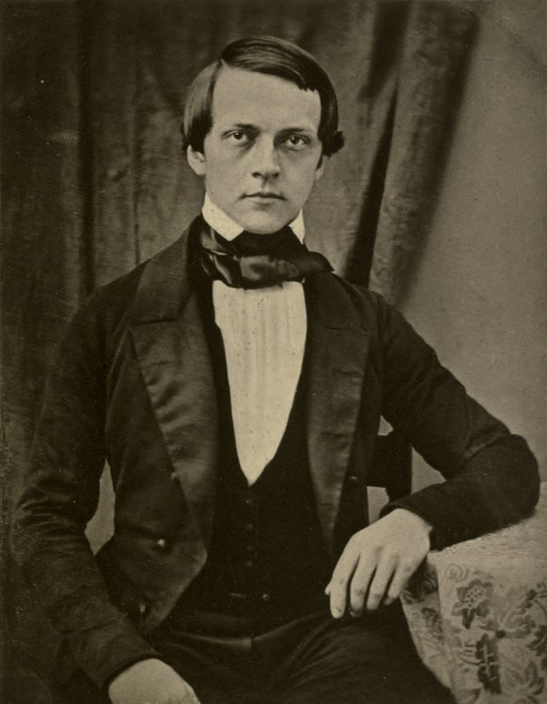

## You are a scientist
 
.pull-left[
```{r, echo = F, out.width='100%'}

```
 ]
 
 .pull-right[
```{r, echo = F, out.width='200%'}

```
 ]
 
???
**Descartes (1637)** -- doubt everything and then take as axiomatic only that which proved to be indubitable ("I think therefore I am") and also division between the mind and body. 
- Descartes was also a physicist and mathematician -- developed analytic geometry (Carteisan coordinates named after deCARTES) 
- hypothesized that that bodies were governed in mechanistic ways -- the brain is a complicated system of tubes and valves for shunting animal spirits into specific nerves and therby enacting specific actions (external pressure on sensing device = reflexes) and this work inspired what became modern day neuroscience. 

**Helmholz (1849)** -- developed tool to measure reaction time to fractions of seconds (galanometer, "stopwatch")
- also invented ophthalmoscope, which examines the inside of the human eye
- _also_ created the Helmholtz resonator, which identifies the various fequencies of complex sounds containing multiple tones
- personally replicated experiments of other scientists to ensure accuracy

---

## Goals of this sequence

- Develop the basic quantitative skills necessary to be a research scientist
    - Not all the skills you will need (not the only courses you need)
    - Foundations of statistics, methods, and data science

- Contextualize those skills
    - Building a toolbox, not a cookbook
    - How can I use this? Under what circumstances? When should I not use this?
    
.small[- Sequence
  - **611**: Tools of statistics 
  - **612**: Building models 
  - **613**: Taking it to the next level]

---

## Goals of this course

  - Conceptualize __statistics__ as a method for specifying and testing a model of how the world works
  
  - Execute and understand of the use and limitations of null hypothesis significance testing
  
  - (in labs) Wrangle, summarize, test, and display data using R
  
  - How do I teach myself something new or solve a problem on my own? 
      - If you only learn one thing this term, focus on this!


---

## Challenges

- Many basic statistical tests were developed a century ago.
  
  - Developed for small samples and hand calculations. 
  - Example: minimum sample size = 30 per cell. Why?
    
--

- This class has variance.

--

- Global pandemic

???

We continue to build off of these tests today. For example, MLM is built off basics of regression and correlation. We need to understand these methods to move forward. 

But the world is changing rapidly. Heuristics don't apply, there are better ways to do things, and we've messed up these statistics a lot. We'll discuss what's often left out of most statistics courses. 

Goal: don't just do the test, understand what the test does, why you might want to use it, and how you can avoid abusing it


---

## Road map

| Week(s) | Topics |
|:-------:||:------|
| 1-2 |Collecting and summarizing data |
| 3-4 |Probability |
| 5   |Sampling and making inferences about the unknown|
| 6-9| Making a decision|
|10| Evaluating that decision|

---

## Graduate school vs undergraduate

**Undergraduate**
* Complete assignment
* Receive grade and (maybe) feedback
* Move on to next assignment

--

**Graduate**
* Attempt assignment
* Receive feedback
* Edit/retry/improve work
* Receive feedback
* ... rinse, repeat...

---

## My goals (practical)

  - Teach you the basics of statistics and R.
  
  - Challenge you -- this class is designed to push you to your personal limit and then just beyond. 
      - If you feel like you're sailing through this class, come talk to me.
      - If you feel like you're drowning, come talk to me.
  
  - Create sitautions in which you can practice skills that will help throughout your career.
      - learning things on your own, asking for help, saying no, teaching others...
  
  - Give everyone an A.

---

## Format

- Learn 
    - Lectures
    - Labs
    - Readings
    
- Practice 
    - Weekly Quizzes (9 total)
    - Homework (3 total)
    
- Demonstrate mastery
    - Oral exam
    
- Get support
    - Journals (10 total)
    
???
There will be some overlap between the readings and lectures, and also between readings and lab. Sometimes there will be overlap between lab and lecture but not always. The goal of this term is to help give you the foundations you need in theory and in tools. We'll put them together more in 612.

Quizzes are meant to test lecture and reading. 
Homework are meant to practice everything.

Talk about quiz policy.

Talk about homework policy.

---

## Materials

- Everything is free and available online

- Materials for this course: [uopsych.github.io/psy611](https://uopsych.github.io/psy611/)

---

## R and RMarkdown

This course will use R and RStudio for all analyses. Why?

- Statistical tool
- Reproducibility
- Workflow
- Marketability

If you want extra help, the library offers `R` workshops, as well as workshops on reproducibility (data management, database and spreadsheets, version control with Git, etc).

The library also has R consultants (GEs) available during most work hours to help troubleshoot.

[https://library.uoregon.edu/research-data-management/training-workshops](https://library.uoregon.edu/research-data-management/training-workshops)

---

## COVID-19

* Lectures will be live-streamed (Zoom) and recorded. 

* If you attend in-person:
  * Keep track of who you sit near.
  * Wear a mask.
  * No eating or drinking.
  * Wash hands.
  * Stay home if sick.
  * Only attend the section you are registered for.
  
* Office hours can be through Zoom or in-person (you choose).
  * Note, I am likely off campus on Wednesdays.

* Course material is fully online (Canvas and class website). 

---

# Questions?

For the rest of today:
- some terminology
- scales of measurement

---

## Kinds of statistics

- Descriptive
- Inferential

???
Which is more important? -- Neither

Descriptive -- about the data
Inferential -- about the world
- assessing risk or uncertainty. How likely?

---

## Kinds of statistics

- Exploratory
- Confirmatory

--


.center[Exploratory ---------------------------------------- Confirmatory]

???
Which is more important? -- Neither

Exploratory -- I don't have a hypothesis or theory. I don't know what's going to happen
Confirmatory -- if theory X is true, then data should look like Y

Really more of a continuum

---

## Kinds of research

- Experimental
- Observational

--

Typically we pair some kinds of statistical tests with experimental work and other kinds of tests with observational work. Examples?

--

In reality, most statistical tests can be used with most kinds of research. It's not so much the kind of research that matters, but __which statistic helps to answer your question__ and __what types of variables do you have?__

- We'll discuss the first point throughout the course
- Let's discuss variables now

---

## Scales of measurement

Four scales
- Nominal
- Ordinal
- Interval 
- Ratio

---

## Nominal

- response options are groups
- no specific order
- example: What is your favorite fruit? Blueberries, apples, coconuts


---

## Ordinal

- response options are ordered
- no consistent distance between possible scores
- example: List the following fruits in order of preference: peaches, grapes, raspberries

---

## Interval

- response options are ordered
- distance between response options is the same
- no meaningful 0 
- example: On a scale from 0-5, how much do you like bananas?


---

## Ratio

- response options are ordered
- distance between response options is the same
- 0 indicates an _absence_ of something
- example: how many times have you eaten watermelon in the last 6 months?

---

## Breakout groups

Pick one of the following constructs and come up with four ways of measuring it (one for each of the scales: nominal, ordinal, interval, ratio):

* Self-esteem
* Political preference
* Memory
* Dog-enthusiasm
* Anxiety

---

## Scales of measurement

.pull-left[
- Nominal

- Ordinal

- Interval 

- Ratio]

.pull-right[
**Why does this matter?**

  ]

---

## Scales of measurement

.pull-left[
- Nominal

- Ordinal

- Interval 

- Ratio]

.pull-right[
**Why does this matter?**

  - Different amounts of information

  ]

---

## Scales of measurement

.pull-left[
- Nominal

- Ordinal

- Interval 

- Ratio]

.pull-right[
**Why does this matter?**

  - Different amounts of information

  - Different mathematical properties
  
    - Example: If Bobby scores 3 and Megan scores 6, can we say Megan scored twice as high as Bobby?
  ]


---

## Scales of measurement

.pull-left[
- Nominal

- Ordinal

- Interval 

- Ratio]

.pull-right[
**What is this?**

- "On a scale from 1 to 6, how much does the word *outgoing* describe you?"]


---

## Scales of measurement

Two types
- Categorical
- Continuous

---

## Scales of measurement

.pull-left[
- Nominal
- Ordinal
- Interval 
- Ratio
]

.pull-right[
- Categorical
- Continuous
]

How do these two methods of describing scales match up?

---
class: inverse 

## Next time

Measurement validity