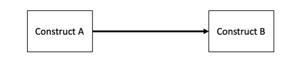
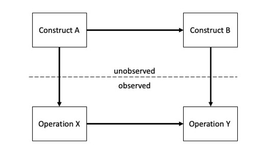
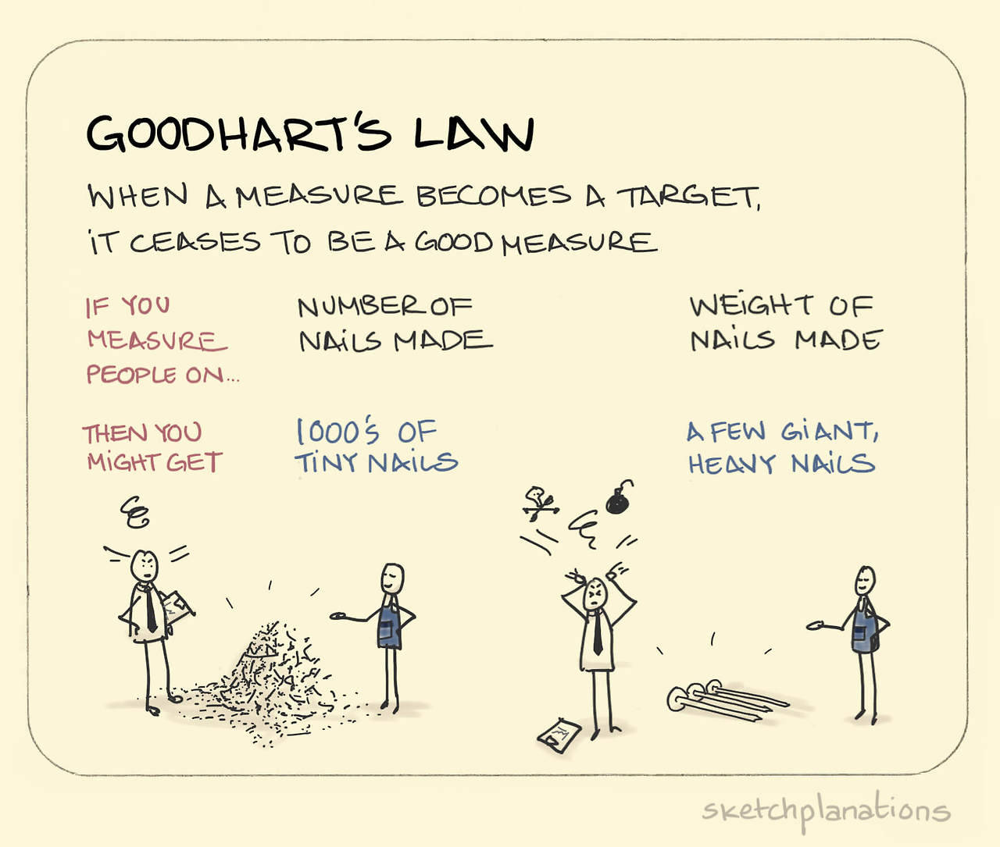
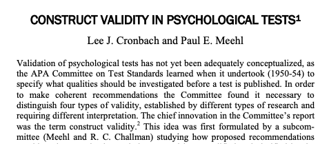
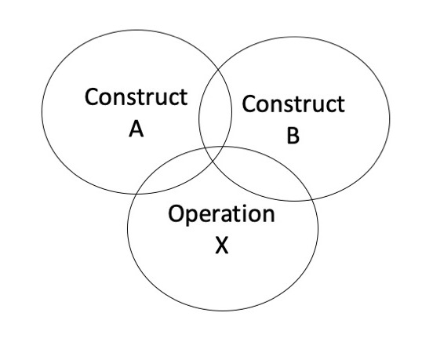

## GitHub

[https://uopsych.github.io/psy611](https://uopsych.github.io/psy611/)

---

## Why statistics

- An essential aid to “signal detection”

- A universal language for communicating what we find.

- Required for competent evaluation of others’ work.

---

class: inverse
## Goal of today

Advanced skill in quantitative methods carries with it the responsibility to use those skills carefully and ethically.

Today, we'll discuss methodological issues present in statistics. 
- It can be tempting to use statistics to fix poor research design.
- These issues cannot be fixed quantitatively (even when it looks like they can).

- After today, we focus on what happens after you collect data. But it is still your job to study research design, data collection, and theoretical logic. 

---

## Constructs

- Our basic goal in science is to make inferences about the causal relations between constructs.
	

---

We can’t do that directly, so we rely on proxies for those constructs.

In order to infer that A --> B, we have to make three assumptions:
 - X is a good proxy for A
 - Y is a good proxy for B
 - X and Y are causally related
 
---

class: middle 

- When the first two assumptions are true, the relation between X and Y will provide a good estimate of the relation between A and B.

- What threatens our ability to carry out this seemingly simple task? 
    - How do quantitative methods help us solve these problems?

---

## Validity

Four kinds of validity in research threaten our ability to make valid causal inferences.  Solving each problem either directly requires quantitative methods or makes use of principles that are central to quantitative methods.

- Statistical conclusion validity

- Internal validity

- Construct validity

- External validity

---

## Statistical conclusion validity

- **Definition:** the validity of the inference that X and Y are related

- most basic: correlation coefficient (
$r_{xy}$
)
    - even more advanced methods index covariation in some way

---

### (Some) threats to statistical conclusion validity

- low statistical power

- violations of assumptions of statistical tests

- fishing and the error rate problem

- unreliable measures

- restricted range

- unreliable treatment implementation

- extraneous variance in the experimental setting

- heterogeneity of units

---

### Low statistical power

The problem of statistical power is easily understood with a simple two-group problem:

.pull-left[

|Group 1 | Group 2 |
|:------:|:-------:|
| $M_1$  | $M_2$   |
| $SD_1$ | $SD_2$  |

]

.pull-right[

$$t = \frac{M_1 - M_2}{\sqrt{\hat{\sigma}^2(\frac{1}{n_1}+\frac{1}{n_2})}}$$

]
.center[

]
--

**Quantitative ways to increase power:**
- Use matching, stratifying or blocking
- Measure and correct for covariates
- Correct for unreliable measurement
- Use within-participants designs
- Ensure that powerful statistical tests are used and their assumptions are met.

???

The formula for the t-test makes clear that power is increased by increasing effect strength (numerator) or decreasing error (denominator). 

The most obvious way to accomplish the latter is
by increasing sample size.  But other tactics are possible, many of them statistical.

---

## Internal validity

- **Definition:** the validity of the inference that X and Y are causally related.

  - Given that X and Y are correlated, can we validly infer that the relation is causal?

--

- Traditional view: direction, correlation, confounds

--

- Counter-factual view
   - Effect is what did happen compared to what would have happened to the same people had they not had the treatment at the same time.
   - Major research design tools: manipulation, control, random assignment, replication, logic, common sense.

    
???

direction = Cause precedes effect

correlation = Cause covaries with effect

confounds = Other explanations are ruled less plausible

---

### Threats to internal validity

.pull-left[
- ambiguous temporal precedence

- selection

- attrition

- history

- maturation

- regression

- testing

- instrumentation
]

---

### Threats to internal validity

.pull-left[
- **ambiguous temporal precedence**

- selection

- attrition

- history

- maturation

- regression

- testing

- instrumentation
]

.pull-right[

Temporal precedence can be established in an experiment because treatment precedes outcome. 

But, when treatment is not possible, then logic and common sense can sometimes dictate temporal precedence.

- prenatal nutrition and cognitive development

- depression and cancer
]

---

### Threats to internal validity

.pull-left[
- ambiguous temporal precedence

- **selection**

- attrition

- history

- maturation

- regression

- testing

- instrumentation
]

.pull-right[

Any systematic differences between groups that might account for an observed effect.

- Test scores of students who visit the Psychology tutoring center vs students who do not visit tutoring center.

How to combat this?
]

???

Combat this with random assignment.

---

### Threats to internal validity

.pull-left[
- ambiguous temporal precedence

- selection

- **attrition**

- history

- maturation

- regression

- testing

- instrumentation
]

.pull-right[

Even if random assignment is used, participants may drop out of the study, producing unequal groups, a situation that has the same inferential problems as selection.

How could the design be modified and statistics used to help rule out selection and attrition confounds?

]

---

### Threats to internal validity

.pull-left[
- ambiguous temporal precedence

- selection

- attrition

- **history**

- maturation

- regression

- testing

- instrumentation
]

.pull-right[

.small[History refers to any event that occurs between the beginning of treatment and the measurement of outcome that might have produced the observed effect.

- A marketing campaign intended to increase beer sales happens to coincide with other events that might have the same effect: a particularly hot period of weather, a long losing streak by the Detroit Tigers, or the Republican National Convention.  How would these threats be eliminated?]

]

---

### Threats to internal validity

.pull-left[
- ambiguous temporal precedence

- selection

- attrition

- history

- **maturation**

- regression

- testing

- instrumentation
]

.pull-right[

Maturation refers to changes in the organism that occur regardless of treatment and that may masquerade as a treatment effect.

- A school-wide educational intervention is predicted to increase achievement test scores.  The entire school must get the same curriculum, so a control group in the school is not possible.  How can the threat be reduced?
]

---

### Threats to internal validity

.pull-left[
- ambiguous temporal precedence

- selection

- attrition

- history

- maturation

- **regression**

- testing

- instrumentation
]

.pull-right[

Regression (to the mean) occurs when participants are selected because of their extreme scores and those scores are unreliable. The scores will regress toward the mean at the second assessment

- *Sports Illustrated* cover jinx
- Tall men father not-so-tall sons (Galton)

How might this problem be reduced?

]

???

Reduce with 
- random assignment
- selection based on multiple measurements

---

### Threats to internal validity

.pull-left[
- ambiguous temporal precedence

- selection

- attrition

- history

- maturation

- regression

- **testing**

- instrumentation
]

.pull-right[

Testing refers to the possible change that may occur just because participants have been previously measured. These are often called practice or fatigue effects.

- Students do better on the first half of test compared to the second.
- Students do better in the second half of the term compared to the first. 

Without adding a control group, how might this threat be reduced?

]

---

### Threats to internal validity

.pull-left[
- ambiguous temporal precedence

- selection

- attrition

- history

- maturation

- regression

- testing

- **instrumentation**
]

.pull-right[

Change may occur because the measurement changes over time, perhaps becoming more or less reliable. 

Instrumentation reflects changes in the measurement; testing reflects changes in the object of measurement.

"When a measure becomes a target, it ceases to be a good measure." (Goodhart)
]

---

---

class: middle

The key point with internal validity is that something else besides the treatment is a plausible alternative explanation for any apparent treatment effect. 

Solving threats to internal validity is a research design problem, not a statistics problem.  Nonetheless, quantitative methods play a key role in making the case for internal validity.

---

### Removing the influence of other variables

If the "other variables" can be measured, their influence can be statistically controlled so that the hypothesized relation can be detected more accurately.

However:

**Statistical control should best be thought of as a method of last resort, to be used when design controls are not available or have failed.**

---

## Construct validity

???

##Apologize for section of article that suggests a link between "homosexual signs" and pathology -- that's just gross

##Questions: 

**1. What is construct validity?** -- Does this variable measure what it says it's going to measure?

**2. How do we determine construct validity?** -- Show that the variable correlates with all of the things it should correlate with and none of the things it shouldn't

**3. How do we figure out what it should correlate with?** -- Nomological net(work); theory
---

## Construct validity

- The validity of the inference that a given operationalization of units, treatments, observations, or settings represents well the construct of which it is assumed to be an instance.

---

class: middle

- Construct validity refers to the correctness of the label that is applied to the operation. It depends on first demonstrating adequate reliability and then is bolstered by demonstrating relations of the target operation to other operations (nomological network of relations).

> "Since the meaning of theoretical constructs is set forth by stating the laws in which they occur, our incomplete knowledge of the laws of nature produces a vagueness in our constructs" (Cronbach & Meehl, 1953, p. 15)

- How would we create a convincing measure of “sense of humor”? 
  - What would make it reliable and valid
  
???

What makes it reliable? (covered in LSR and C&M)
- internal consistency (inter-rater reliability, test-retest)
---

---

### Threats to construct validity

- inadequate explication of constructs

- construct confounding

- confounding constructs with levels of constructs

- reactive self-report changes

- reactivity to the experimental situation

- experimenter expectancy

- novelty and disruption effects

---
### Construct confounding

.pull-left[Operations usually tap more than one construct. Failure to recognize the full set of constructs embedded in the operation can lead to incorrect inferences about the constructs that are active.

A self-report of optimism might also reflect self-esteem or positive affect.  How can quantitative methods help?

]

--

.pull-right[A key distinction: With construct validity, the dispute is not about the causal relation between operational definitions. The dispute concerns how those operational definitions should be labeled.
]

???

**SARA:** Draw Venn diagram with 3 circles: Construct A, Construct B, and Operation X

---

## External validity 

- **Definition:** The validity of the inference that a causal relation between operations generalizes to other units, treatments, observations, or settings.

---
### Threats to external validity

- interaction of the causal relation with units

- interaction of the causal relation with treatment variations

- interaction of the causal relation with observations

- interaction of the causal relation with settings

- context-dependent mediation

Quantitative methods provide a powerful way to demonstrate moderation (interactions) and mediation effects.

---

## Measurement and statistics

The characteristics of measures (like reliability) are defined quantitatively.

.pull-left[
$$r_{KK} = \frac{K\bar{r_{ij}}}{1 + (K-1)\bar{r_{ij}}}$$

Formula for coefficient 
$\alpha$
where 
$K$ 
is the number of items and 
$\bar{r_{ij}}$
is the average correlation between any two items on the test.

*By the way, 
$\alpha$
is a poor measure of reliability.
]

.pull-right[
$$r_{xy} = \rho_{xy}\sqrt{r_{xx}r_{yy}}$$

Formula for the sample correlation between constructs 
$X$ 
and 
$Y$
given internal consistencies
$r_{xx}$ 
and 
$r_{yy}$.
]

---

## Goal

Advanced skill in quantitative methods carries with it the responsibility to use those skills carefully and ethically.

---

## Next time...

describing samples and populations