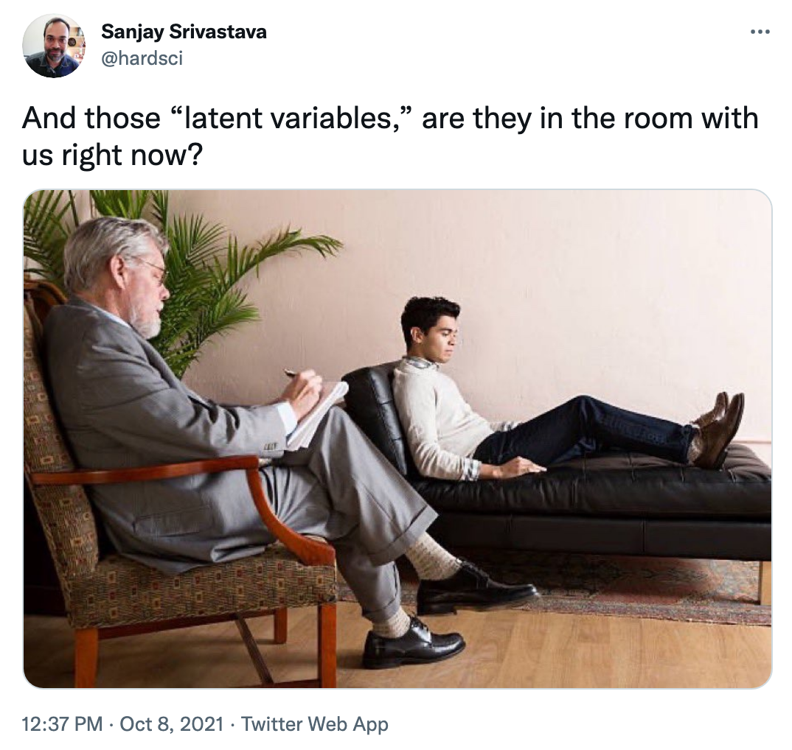
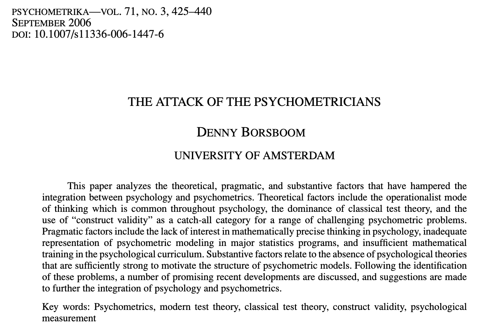
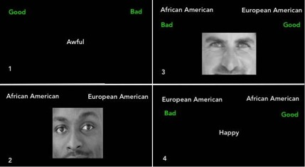
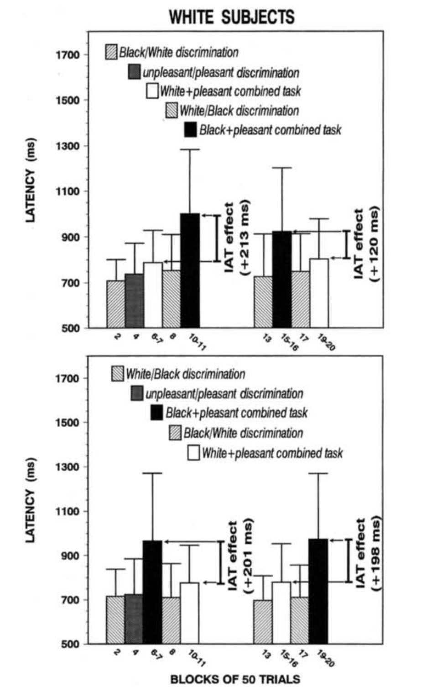
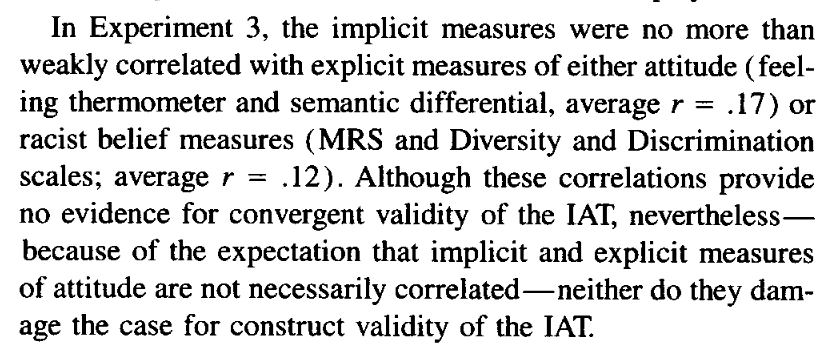

```{r, include = F}
library(tidyverse)
library(knitr)
library(kableExtra)
library(ggpubr)
library(directlabels)
options(knitr.kable.NA = '')
```

```{css, echo=F}
    /* Change the background color to white for shaded rows (even rows) */

    .remark-slide thead, .remark-slide tr:nth-child(2n) {
        background-color: white;
    }
```

## Last time

* Descriptive statistics

  * Central tendency
  * Spread
  
  * Correlations

???

* What does correlation communicate?
* Range? What does direction mean?
* What is a large correlation? 

---

## Today

Moral of the story: measuring stuff is hard. Put some thought into it.

---

## Quantitude podcast

* According to Curran and Hancock, what is a latent variable?

* What are some examples of latent variables in the podcast?

???

From C&H

Latent variables -- the things we cannot directly observe
Variable -- individual differences on it
A placeholder for the covariation among a set of variables.

  Is it missing for at least some of the observations in your dataset?

Examples: depression, anxiety, the economy, the quality of a college/uni, Pandora music station, gravity, disease or underlying conditions

---

### [Bollen (2002)](../readings/Bollen_2002.pdf)

Definitions of latent variables:
.pull-left[
* Informal
  * Hypothetical construct
  * Unmeasureable
  * Data reduction
]
.pull-right[
* Formal
  * Local independence
  * Expected value
  * Nondeterministic function
]

???

Underlying assumption of these definitions: we measure latent variables using multiple observed variables

--

Sample realization definition: A latent random (or nonrandom) variable is a random (or nonrandom) variable for which there is no sample realization for at least some observations in a given sample.

---
```{r, echo = F, out.width='75%'}

```

---

### Measuring latent variables

If latent variables are unobserved, how do we study them?

--

* The challenge of **psychometrics** is assign numbers to observations in a way that best summarizes the underlying constructs ([Revelle, 2009](http://personality-project.org/r/book/Chapter3.pdf))

How do we create this in our dataset (practically speaking)?

--

* With the people around you, come up with one latent variables that you might be interested in and describe how you would measure them.

???

Walk students through example of job success How would you measure this? What items would you use? How would you assign numbers to those items?

How would you use those numbers to create a job success score?

---

### Thinking about measurements

What questions should we ask ourselves as we construct latent variables?

--

* What else does our measure capture?

* (If multiple items) are all items weighted equally?

* (If multiple items) are items causal indicators or effect indicators?

* Is our latent variable _a posteriori_ and _a priori_?

???

Use job success measure. How are observations biased?
(who gets raises or promotions?)

---

### Relationship between latent variables and theory

Latent variables live at the level of theory. 

* Your theory is about success/happiness/arousal/memory/etc, not about the measure (items or operationalizations).

* Does your theory specify how the latent variable is associated with your measure?
    * Probably not... we'll return to this.
  

---

### Relationship between latent variables and theory

Do you need theory for good statistics or empirical work?

* Machine learning models
  
  * Don't need theory to make predictions.
  * In fact, best predictions often come by throwing out theory.

* Network models

  * No underlying theory about the cause of covariation between items. 
  * Allows for exploration of item structure.
  * E.g., work on [depression](https://eiko-fried.com/)
  
---


---

## What's wrong with latent variables



---

[Borsboom (2006)](../readings/Borsboom_2006.pdf) argues that good measurement practices -- specifically, testing that measures capture latent variable -- has been ignored in psychology.


* Operationalizations assumed substitutes for latent variables
* No exploration or tests of whether measure captures latent variable
* Construct validity (Cronbach & Meehl, 1955, among others) made to seem too difficult

---

### IAT


```{r, echo = F, out.width='100%'}

```

???


Go through assumptions

* Operationalizations assumed substitutes -- what are we actually trying to measure? 

---

### IAT
.pull-left[
```{r, echo = F, out.width='100%'}

```
]
.pull-right[
From Greenwald, McGhee, & Schwartz ([1998](https://pubmed.ncbi.nlm.nih.gov/9654756/))
]

???

* No exploration or tests of whether more captures latent variable
* Evidence presented is group means, not individual differences.
* What's the theory underlying this. What is the shape of the outcome? Is it really linear? Is there a cut-off? How do practice effects weigh in?

---

### IAT


From Greenwald, McGhee, & Schwartz ([1998](https://pubmed.ncbi.nlm.nih.gov/9654756/))

???
 Construct validity is hard, am I right?

---

## The underlying process

Where do the numbers come from? 

What assumptions do our statistics make about where the numbers come from?

A few examples from Revelle ([2009](http://personality-project.org/r/book/Chapter3.pdf))

---

### Whose point of view?

Consider the problem of a department chairman who wants to recruit faculty by emphasizing the smallness of class size but also report to a dean how effective the department is at meeting its teaching requirements. What is the typical class size?

```{r, echo = F, results = 'asis'}
tribble(
  ~`Faculty Member`, ~`Freshman/Sophmore`, ~`Junior`, ~`Senior`, ~`Graduate`, ~Mean, ~Median,
  "A",  20,  10,  10, 10,  12.5,  10,
  "B",  20,  10,  10, 10,  12.5,  10,
  "C",  20,  10,  10, 10,  12.5,  10,
  "D",  20, 100,  10, 10,  35.0,  15,
  "E", 200, 100, 400, 10, 177.5, 150,
  "Mean", 56, 46, 110, 10, 50.0, 39,
  "Median", 20, 10, 10, 10, 12.5, 10
  ) %>% 
  kbl %>% 
  kable_classic %>% 
  group_rows("Total", 6, 7) %>% 
  column_spec(6, background = "lightgray") %>% 
  column_spec(7, background = "lightgray") %>% 
  row_spec(6, background = "lightgray") %>% 
  row_spec(7, background = "lightgray")
```

???

Tell faculty that median class size is 10 and tell dean the mean class size is 50. Excellent!

---

What about from the students' perspective?

```{r, echo = F, results = 'asis'}
tribble(
  ~`Class size`, ~`Number of classes`, ~`Number of students`, 
    10, 12, 120,
    20, 4, 80,
    100, 2, 200,
    200, 1, 200,
    400, 1, 400
  ) %>% 
  kbl %>% 
  kable_classic 
```

```{r}
class_size = c(rep(10, 120),
               rep(20, 80),
               rep(100, 200),
               rep(200, 200),
               rep(400, 400))
mean(class_size)
median(class_size)
```

---

### Is the process generating numbers linear?

Many of the statistics we use (e.g., mean) assume the process generating numbers is linear. That is, as you move up on the latent construct, you move in a linear fashion along the measurement. What happens if that's not the case?

---

Scores indicate the time of day the subject experienced their peak. 


```{r, echo = F, results = 'asis'}
tribble(
  ~Subject, ~`Energetic Arousal`, ~`Positive Affect`, ~`Tense Arousal`, ~`Negative Affect`,
  "1",  9, 14, 19, 24,
  "2", 11, 16, 21,  2,
  "3", 13, 18, 23,  4,
  "4", 15, 20,  1,  6,
  "5", 17, 22,  3,  8,
  "6", 19, 24,  5, 10,
  "Arithmetic", 14, 19, 12, 9,
  "Circular", 14, 19, 24, 5,
) %>% 
  kbl %>% 
  kable_classic %>% 
  group_rows("Mean", 7, 8)
```

---

### Non-linearirty and pre-existing differences

The issues of non-linearity are especially troublesome when there are pre-existing differences between groups. This can lead to interactions at the level of the observations (measures/operationalization) even when there are not interactions at the level of the latent variable. 

Consider a study of "thematic analysis" across three schools: 
* a "high-quality, high prestige 4-year liberal arts college located in New
England" (Ivy)
* a "4-year state supported institution, relatively nonselective, and enrolling mostly lower-middle-class
commuter students who are preparing for specific vocations such as teaching" (TC)
* a community college (CC).

(From Winter & McClelland, 1978)

---

```{r, echo = F}
prob_correct = function(theta, delta){
  1/(1 + exp(delta-theta))
}

expand.grid(
  school = c("CC", "TC", "Ivy"),
  year = seq(0,4, length.out = 100)
) %>% 
  mutate(
    initial = case_when(
      school == "CC" ~ -1,
      school == "TC" ~  0,
      school == "Ivy" ~ 1,),
    ability = initial + year,
    performance = map_dbl(ability, prob_correct, delta = 4)) %>% 
  ggplot(aes(x = year, y = performance, group = school)) +
  geom_line() +
  geom_dl(aes(label = school), method = "last.points") +
  labs(title = "Writing ability") +
  theme_pubr()
  
```


What is your conclusion?

---

```{r, echo = F}
expand.grid(
  school = c("CC", "TC", "Ivy"),
  year = seq(0,4, length.out = 100)
) %>% 
  mutate(
    initial = case_when(
      school == "CC" ~ -1,
      school == "TC" ~  0,
      school == "Ivy" ~ 1,),
    ability = initial + year,
    performance = map_dbl(ability, prob_correct, delta = 1)) %>% 
  ggplot(aes(x = year, y = performance, group = school)) +
  geom_line() +
  geom_dl(aes(label = school), method = "last.points") +
  labs(title = "Math ability") +
  theme_pubr()
  
```

What is your conclusion?

---

.pull-left[
```{r, echo = F}
expand.grid(
  school = c("CC", "TC", "Ivy"),
  year = seq(0,4, length.out = 100)
) %>% 
  mutate(
    initial = case_when(
      school == "CC" ~ -1,
      school == "TC" ~  0,
      school == "Ivy" ~ 1,),
    ability = initial + year,
    performance = map_dbl(ability, prob_correct, delta = 4)) %>% 
  ggplot(aes(x = year, y = performance, group = school)) +
  geom_line() +
  geom_dl(aes(label = school), method = "last.points") +
  scale_y_continuous(limits = c(0,1)) +
  labs(title = "Writing ability") +
  theme_pubr()
  
```
]

.pull-right[
```{r, echo = F}
expand.grid(
  school = c("CC", "TC", "Ivy"),
  year = seq(0,4, length.out = 100)
) %>% 
  mutate(
    initial = case_when(
      school == "CC" ~ -1,
      school == "TC" ~  0,
      school == "Ivy" ~ 1,),
    ability = initial + year,
    performance = map_dbl(ability, prob_correct, delta = 1)) %>% 
  ggplot(aes(x = year, y = performance, group = school)) +
  geom_line() +
  scale_y_continuous(limits = c(0,1)) +
  geom_dl(aes(label = school), method = "last.points") +
  labs(title = "Math ability") +
  theme_pubr()
  
```
]

Both panels are generated from the exact same monotonic curve, but with items of different difficulties.

$$prob(correct|\theta,\delta) = \frac{1}{1+e^{\delta-\theta}}$$

---

## Takeaways

* Latent variables are not directly measured for at least some people in a given sample
* We try to infer the value of a latent variable through our observed variable(s)
* In doing so, we must bring theory to bear, not only on how the latent variable connects to other (latent) variables or constructs, but specifically how our latent variable is related to our operationalization
* Misspecifying the relationship between latent variables and operationalizations can result in misleading or wrong results.

---

class: inverse

## Next time...

Probability

<!-- Physiological arousal is thought to reflect levels of excitement, alertness and energy.  -->
<!-- * Two psychophysiological indicators of the degree of palmer sweating.  -->
<!-- * **Skin conductance (SC)** is measured by passing a small current through two electrodes, one attached to one finger, another attached to another finger.  -->
<!-- * **Skin resistance (SR)** is also measured by two electrodes, and reflects the resistance of the skin to passing an electric current. -->
<!-- * These two measures are the reciprocal of one another.  -->


<!-- --- -->

<!-- Consider two experimenters, A and B. They both are interested in the effect of an exciting movie upon the arousal of their subjects. Experimenter A uses Skin Conductance, experimenter B measures Skin Resistance. They first take their measures, and then, after the movie, take their measures again. -->

<!-- ```{r, echo = F, results = 'asis'} -->
<!-- data.frame( -->
<!--   #Condition = c("Pretest", "Pretest", "Average", "Posttest", "Posttest", "Average"), -->
<!--   Subject = c(1, 2, NA, 1, 2, NA), -->
<!--   Conductance = c(2, 2, 2, 1, 4, 2.5), -->
<!--   Resistance = c(.50, .50, .5, 1, .25, .63) -->
<!-- ) %>%  -->
<!--   kable(escape = F, booktab = T) %>%  -->
<!--   kable_styling(font_size = 16) %>%  -->
<!--   group_rows("Pretest", 1, 2) %>%  -->
<!--   group_rows("Average", 3, 3) %>%  -->
<!--   group_rows("Posttest", 4, 5) %>%  -->
<!--   group_rows("Average", 6, 6) -->
<!-- ``` -->
<!-- --- -->

<!-- ```{r} -->
<!-- conductance = seq(1, 5, length = 100) -->
<!-- resistance = 1/conductance -->
<!-- plot(conductance, resistance, type = "l") -->
<!-- ``` -->

<!-- --- -->

<!-- ```{r, echo = F, fig.width = 10, fig.height = 8} -->
<!-- xcoord = c(2, 2, 1, 4) -->
<!-- ycoord = c(.5, .5, 1, .25) -->
<!-- conductance = seq(1, 5, length = 100) -->
<!-- resistance = 1/conductance -->
<!-- plot(conductance, resistance, type = "l") -->
<!-- points(xcoord, ycoord) -->
<!-- text(xcoord, ycoord,  -->
<!--      label = c("Pre S1", "Pre S2", "Post S1", "Post S2"),  -->
<!--      pos = 4) -->
<!-- ``` -->

<!-- --- -->

<!-- ```{r, echo = F, fig.width = 10, fig.height = 8} -->
<!-- xcoord = c(2, 2, 1, 4) -->
<!-- ycoord = c(.5, .5, 1, .25) -->
<!-- conductance = seq(1, 5, length = 100) -->
<!-- resistance = 1/conductance -->
<!-- plot(conductance, resistance, type = "l") -->
<!-- points(xcoord, ycoord) -->
<!-- text(xcoord, ycoord,  -->
<!--      label = c("", "", "Post S1", "Post S2"),  -->
<!--      pos = 4) -->
<!-- points(c(2, 2.5), c(.5, .63)) -->
<!-- text(c(2, 2.5), c(.5, .63), label = c("Mean Pre", "Mean Post")) -->
<!-- segments(xcoord[3], ycoord[3], xcoord[4], ycoord[4]) -->
<!-- ``` -->

<!-- --- -->

<!-- What's the real conclusion? -->

<!-- * The movie induces greater variability -->


<!-- What's the moral? -->

<!-- * We don't expect either of these variables to behave linearly -- there are bounds.  -->
<!-- * A traditional mean calculation won't work here.  -->

<!-- A similar situation is measuring a construct over time that has circular rhythms. Think of anything that goes up and down over the course of a day (energy, affect, etc). -->