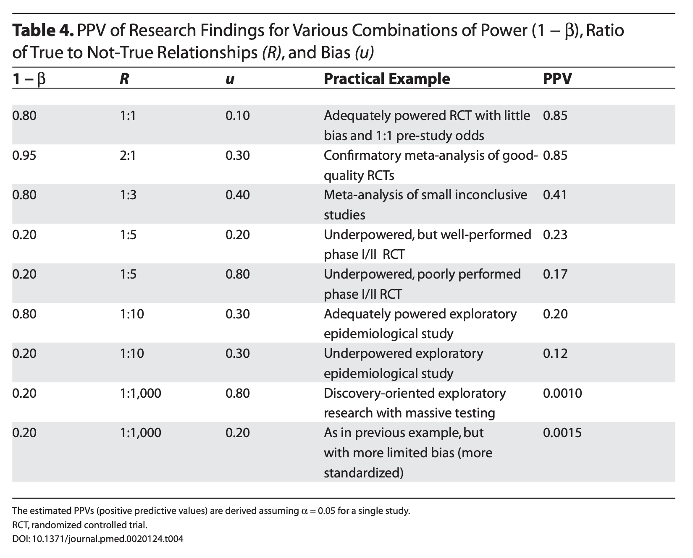
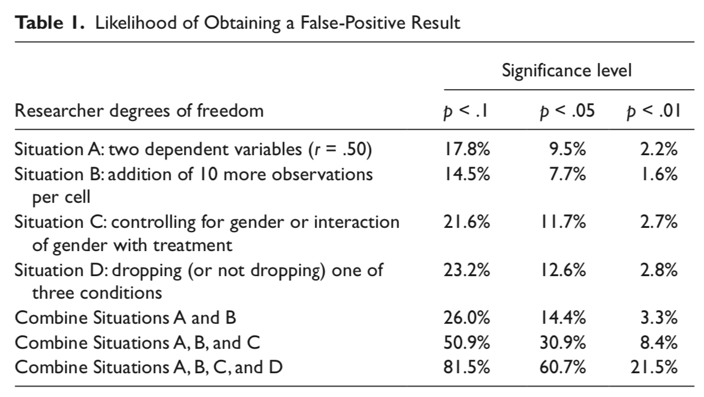
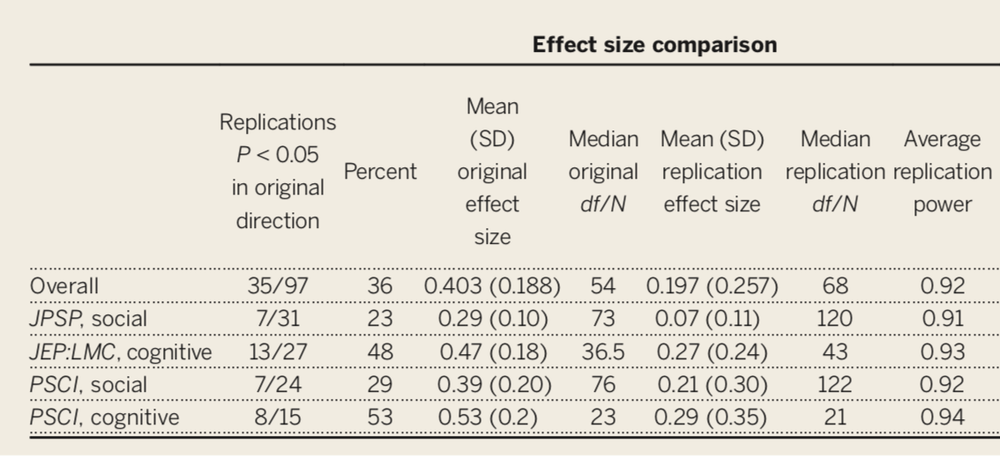
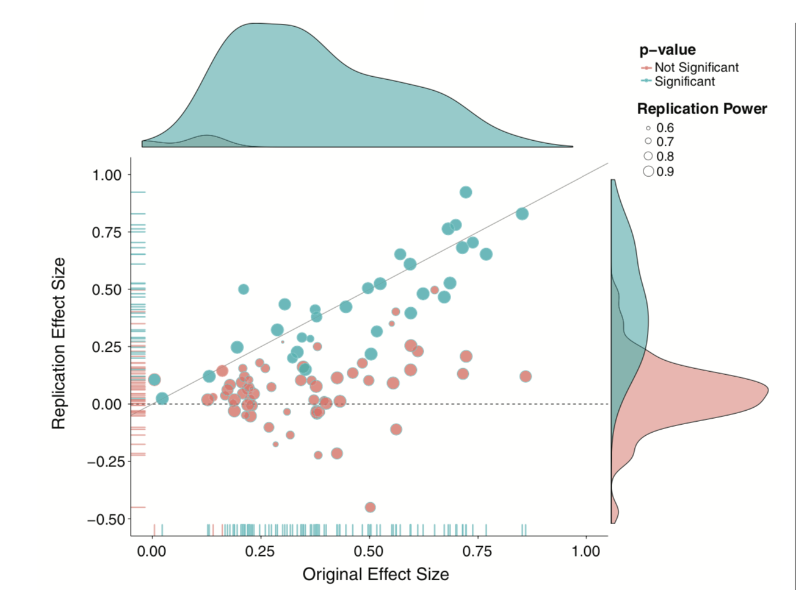
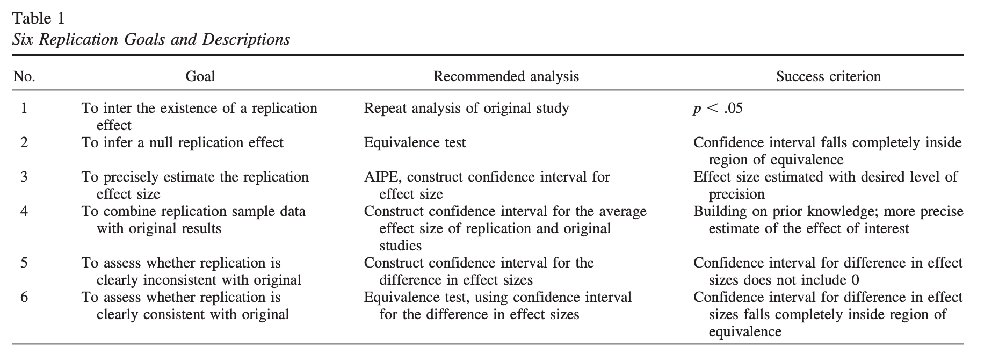

## Annoucements

- Nov 11 is a university holiday
- Homework #2 due Friday (9am)

---
```{r, include = F}
library(tidyverse)
library(ggpubr)
```


## Recap

Does switching environments improve memory? On a standard memory task, participants remember 17.7 words (out of 30) $(\sigma = 3.2)$ after studying word lists for 9 minutes. You recruit a sample of 8 participants and make them study word lists in the student center. Every 3 minutes, they are required to stand up and move to a different room in the student center. After studying, participants are tested. On average, they remember 19.1 words $(s = 2.9)$. 

```{r, echo = F}
mu = 17.7
sigma = 3.2
n = 9
xbar = 19.1

sem = sigma/sqrt(n)

cv_pos = mu + 1.96*sem
cv_neg = mu - 1.96*sem

zstat = (xbar-mu)/sem
```

???

sem = `r round(sem,2)`

cv = [`r round(cv_neg,2)`, `r round(cv_pos,2)`]

zstat = `r round(zstat,2)`


---

.pull-left[

```{r, echo = F}
lower_bound = mu-3*sem
upper_bound = mu+3*sem

data.frame(M = c(lower_bound:upper_bound)) %>%
  ggplot(aes(x = M)) +
   stat_function(fun = function(x) dnorm(x, mean = mu, sd = sem), 
                 geom = "line") +
  stat_function(fun = function(x) dnorm(x, mean = mu, sd = sem), 
                 geom = "area", fill = "purple", xlim = c(cv_pos, upper_bound)) +
  stat_function(fun = function(x) dnorm(x, mean = mu, sd = sem), 
                 geom = "area", fill = "purple", xlim = c(lower_bound, cv_neg)) +
  geom_vline(aes(xintercept = xbar), color = "red", linetype = "dashed") +
  scale_x_continuous(breaks = round(c(lower_bound:upper_bound))) + 
  labs(x = "Mean", y = "density", title = "Sampling distribution in original scale")+
  theme_pubr()
```
]

.pull-right[

```{r, echo = F}
data.frame(M = c(-3:3)) %>%
  ggplot(aes(x = M)) +
   stat_function(fun = function(x) dnorm(x), 
                 geom = "line") +
  stat_function(fun = function(x) dnorm(x), 
                 geom = "area", fill = "purple", xlim = c(1.96, 3)) +
  stat_function(fun = function(x) dnorm(x), 
                 geom = "area", fill = "purple", xlim = c(-3, -1.96)) +
  geom_vline(aes(xintercept = zstat), color = "red", linetype = "dashed") +
  scale_x_continuous(breaks = c(-3:3)) +
  labs(x = "Z-statistic", y = "density", title = "Sampling distribution in Z-statistic units")+
  theme_pubr()
```
]

The probability of getting this sample mean in this sampling distribution is:

```{r}
pnorm(q = 19.1, mean = 17.7, sd = 1.067, lower.tail = F)*2

pnorm(q = 1.3125, lower.tail = F)*2
```

---

## Recap: Errors

What kind of error could we have just made?

--

How do I assess the probability of errors?

--

Type I error (false positive) is equal to $\alpha$. You, the researcher, choose the Type I error rate you are comfortable with. 

Type II error (false negative) depends on making a guess about the effect size. This determines the mean of an alternative distribution

---

```{r, echo = F}
data.frame(M = c(lower_bound:(upper_bound+5))) %>%
  ggplot(aes(x = M)) +
  stat_function(fun = function(x) dnorm(x, mean = mu, sd = sem), 
                 geom = "line") +
  stat_function(aes(fill = "Type I error"), fun = function(x) dnorm(x, mean = mu, sd = sem), 
                 geom = "area", xlim = c(cv_pos, upper_bound),
                alpha = .5) +
  stat_function(aes(fill = "Type I error"), fun = function(x) dnorm(x, mean = mu, sd = sem), 
                 geom = "area", xlim = c(lower_bound, cv_neg),
                alpha = .5) +
  stat_function(fun = function(x) dnorm(x, mean = mu+3, sd = sem), 
                 geom = "line") +
  geom_vline(aes(xintercept = cv_pos, color = "Type I error")) +
  scale_x_continuous(breaks = seq(14,26,2), limits = c(14,26)) +
  guides(color = "none") +
  labs(x = "Mean", y = "density", title = "Sampling distribution in original scale", fill = NULL)+
  theme_pubr()
```

---

```{r, echo = F}
data.frame(M = c(lower_bound:(upper_bound+5))) %>%
  ggplot(aes(x = M)) +
   stat_function(fun = function(x) dnorm(x, mean = mu, sd = sem), 
                 geom = "line") +
  stat_function(aes(fill = "Type II error"), fun = function(x) dnorm(x, mean = mu+3, sd = sem), 
                 geom = "area", xlim = c(lower_bound, cv_pos),
                alpha = .5) +
  stat_function(aes(fill = "Power"), fun = function(x) dnorm(x, mean = mu+3, sd = sem), 
                 geom = "area", xlim = c(cv_pos, upper_bound+5),
                alpha = .5) +
  stat_function(fun = function(x) dnorm(x, mean = mu+3, sd = sem), 
                 geom = "line") +
  geom_vline(aes(xintercept = cv_pos, color = "Type I error")) +
  scale_x_continuous(breaks = seq(14,26,2), limits = c(14,26)) +
  scale_fill_brewer(palette = "Dark2") +
  guides(color = "none") +
  labs(x = "Mean", y = "density", title = "Sampling distribution in original scale", fill = NULL)+
  theme_pubr()
```

---

### How can power be increased?


.pull-left[

```{r student null and alt, echo = F}
data.frame(M = c(lower_bound:(upper_bound+5))) %>%
  ggplot(aes(x = M)) +
   stat_function(fun = function(x) dnorm(x, mean = mu, sd = sem), 
                 geom = "line") +
  stat_function(fun = function(x) dnorm(x, mean = mu, sd = sem), 
                 geom = "line") +
  stat_function(aes(fill = "Type I error"), fun = function(x) dnorm(x, mean = mu, sd = sem), 
                 geom = "area", xlim = c(cv_pos, upper_bound),
                alpha = .5) +
  stat_function(aes(fill = "Type I error"), fun = function(x) dnorm(x, mean = mu, sd = sem), 
                 geom = "area", xlim = c(lower_bound, cv_neg),
                alpha = .5) +
  stat_function(aes(fill = "Type II error"), fun = function(x) dnorm(x, mean = mu+3, sd = sem), 
                 geom = "area", xlim = c(lower_bound, cv_pos),
                alpha = .5) +
  stat_function(aes(fill = "Power"), fun = function(x) dnorm(x, mean = mu+3, sd = sem), 
                 geom = "area", xlim = c(cv_pos, upper_bound+5),
                alpha = .5) +
  stat_function(fun = function(x) dnorm(x, mean = mu+3, sd = sem), 
                 geom = "line") +
  geom_vline(aes(xintercept = cv_pos, color = "Type I error")) +
  #scale_x_continuous(breaks = c(14:26), limits = c(14:26)) + 
  scale_fill_brewer(palette = "Dark2") +
  guides(color = "none") +
  labs(x = "Mean", y = "density", title = "Sampling distribution in original scale", fill = NULL)+
  theme_pubr()

```
]
.pull-right[
$$Z_1 = \frac{CV_0 - \mu_1}{\frac{\sigma}{\sqrt{N}}}$$

- increase $\mu_1$
- decrease $CV_0$
- increase $N$
- reduce $\sigma$
]

---

Often the most challenging part of a power analysis is to settle on an effect size.  

- Past research can often provide some guidance, especially if a meta-analysis is available. 

    - Note that these are often over-estimates. 

- Sometimes a field might have standards regarding what counts as a meaningful effect (e.g., minimal clinically important difference).  

- Lacking this information, we can settle for more abstract benchmarks or rules of thumb about what are “small,” “medium”, and “large” effects. 
    
    - But as we discussed, these benchmarks need to be contextualized in real-world outcomes.

    - Complicating these choices, effect sizes come in a variety of metrics.
    
---
### Prevalence of false positives

Consider where $\alpha$, $\beta$ and power fall in this grid. 


|             |   Reject $H_0$   |   Do not reject  |
|------------:|:----------------:|:----------------:|
|  $H_0$ True |   Type I Error   | Correct decision |
| $H_0$ False | Correct decision |   Type II Error  |

---
### Prevalence of false positives

Consider where $\alpha$, $\beta$ and power fall in this grid. 


|             |   Reject $H_0$   |   Do not reject  |
|------------:|:----------------:|:----------------:|
|  $H_0$ True |   $\alpha$   | $1-\alpha$ |
| $H_0$ False | $1-\beta$ |   $\beta$  |

What is the sum of these cells?

---
### Prevalence of false positives

Figuring out how common Type I and Type II errors are in a literature requires an additional piece of information:

- How often $H_0$ is true.

[Ioannidis (2005)](../readings/Ioannidis_2005.pdf) demonstrates that given R (the ratio of $H_0$ false over $H-0$ true), we can calculate the **positive predictive value** of a finding, which is the likelihood that $H_1$ is true given we found a significant result:

$$\frac{(1-\beta)R}{(1-\beta)R+\alpha}$$
???

Note that given publication bias, or the tendancy to only publish significant results, PPV can be thought of as the likelihood of a given published study being a false positive.

---

Let's make some assumptions. If psychology studies use $\alpha = .05$ and are good at achieving adequate power ( $1-\beta = .80$ ), how does the choice of hypothesis affect PPV?

```{r, echo = F, message = F, warning = F}
ppv_fun = function(R, beta = .20, alpha = .05){
  ppv = ((1-beta)*R)/((1-beta)*R + alpha)
  return(ppv)
}

data.frame(prob = seq(0,1, by = .01)) %>%
  mutate(ratio = prob/(1-prob),
         ppv = ppv_fun(ratio)) %>%
  ggplot(aes(x = prob, y = ppv)) +
  geom_line() +
  scale_x_continuous(expression("Probability that"~H[1]~"is true")) +
  scale_y_continuous("Positive Predictive Value")+
  theme_pubr(base_size = 20)
```
---

However, there are many reasons to think that psychology studies are underpowered. Typical power may be closer to .5 or even worse. 

```{r, echo = F, message = F, warning = F}
data.frame(prob = seq(0,1, by = .01)) %>%
  mutate(ratio = prob/(1-prob),
         ppv = ppv_fun(ratio),
         ppv_low = ppv_fun(ratio, beta = .5)) %>%
  ggplot(aes(x = prob)) +
  geom_line(aes(y = ppv, color = ".80")) +
  geom_line(aes(y = ppv_low, color = ".50")) +
  scale_x_continuous(expression("Probability that"~H[1]~"is true")) +
  scale_y_continuous("Positive Predictive Value")+
  scale_color_discrete("Power")+
  theme_pubr(base_size = 20)
```

---

In addition to being under-powered, there's recognition that research practices have inflated family-wise error, making $\alpha$ much bigger than it should be. 

```{r, echo = F, message = F, warning = F}
data.frame(prob = seq(0,1, by = .01)) %>%
  mutate(ratio = prob/(1-prob),
         ppv = ppv_fun(ratio),
         ppv_low = ppv_fun(ratio, beta = .5),
         ppv_alp = ppv_fun(ratio, alpha = .20),
         ppv_low_alp = ppv_fun(ratio, beta = .5, alpha = .20)) %>%
  ggplot(aes(x = prob)) +
  geom_line(aes(y = ppv, color = ".80", linetype = ".05")) +
  geom_line(aes(y = ppv_low, color = ".50", linetype = ".05")) +
  geom_line(aes(y = ppv_alp, color = ".80", linetype = ".20")) +
  geom_line(aes(y = ppv_low_alp, color = ".50", linetype = ".20")) +
  scale_x_continuous(expression("Probability that"~H[1]~"is true")) +
  scale_y_continuous("Positive Predictive Value")+
  scale_color_discrete("Power")+
  scale_linetype_discrete("Alpha") +
  theme_pubr(base_size = 20)
```
---




---
### Critiques of NHST

Many will describe the current "replication crisis" or "reproducibility crisis" or "open science movement" as tracing its beginnings to 2011, mostly due to:

- [Bem. (2011). Feeling the future.](../readings/Bem_2011.pdf) 
- [Simmons, Nelson, & Simonsohn. (2011). False-positive psychology. ](../readings/Simmons_etal_2011.pdf)


But the reality is that NHST has always had its critics. And it's not for lack of eloquence that they have been ignored...


> "What's wrong with [NHST]? Well, among many other things, it does not tell us what we want to know, and we so much want to know what we want to know that, out of desperation, we nevertheless believe that it does!" – Cohen (1994)


---

### What kind of mess have we gotten ourselves into?

- $p < .05$ as a condition for publication

- Publication as a condition for tenure

- Novelty as a condition for publication in top-tier journals

- Institutionalization of NHST

- High public interest in psychological research

- Unavoidable role of human motives: fame, recognition, ego

---

### What kind of science have we produced?

- $p < .05$ as a primary goal

- Publication bias: “Successes” are published, “failures” end up in file drawers

- Overestimation of effect size in published work

- Underestimation of complexity (why did the failures occur?)

- Underestimation of power

- Inability to replicate

- Settling for vague alternative hypotheses: “We expect a difference”

???

Ask students to define replication

---

### What kind of science have we produced?

- Dichotomous thinking (based on $p$ ): research either “succeeds” or “fails” to find the expected difference

- No motivation to pursue failures to reject the null

- Harvesting (mostly) the low-hanging fruit in science to publish quickly and often.

- Weak theory
  - Low precision (“differences” are enough)
  - No non-nil null hypotheses
  - Weak, slow progress as a science

---

### Focusing on $p$ -values

Let's start with some intuition. 

Imagine you conduct two studies. Assuming your **alpha is .05** and the **null is true**, what is the probability that the first study or the second study or both studies yield significant results?

- Less than 5%?
- Exactly 5%? 
- More than 5%?

???

Correct answer is 9.75%

$P(A \cup B) = P(A) + P(B) - P(A\cap B)$

$P(A \cup B) = .05 + .05 - (.05*.05) = .10 - .0025$

---
### Focusing on $p$ -values

Imagine rolling a die. 

- What’s the probability you roll a 2?
    - $P(6) = 1/20 = 16.7\%$

- If you roll the die twice, what’s the probability that you get a 2 at least once? $30.6\%$

- If you roll the die 5 times, what’s the probability that you get a 2 at least once? $59.8\%$
  
Roll the die enough times, and you'll get a 2 eventually. Significance testing when the null is true is like rolling a 20-sided die. 

---

## False Positive Psychology

[Simmons et al. (2011)](../readings/Simmons_etal_2011.pdf) pointed out that each study is not a single roll of the die.

Instead, each study, even those with a single statistical test, might represent many rolls of the die. 

- **Researcher degrees of freedom:** Decisions that a researcher makes that change the statistical test. 
  - Examples:
      - Additional dependent variabiles
      - Tests with and without covariates
      - Data peeking (testing effect as data comes in and stopping when result is significant)


---

Each time I see how a decision affected my result, I am rolling the dice again. 



???

from Simmons et al: The table reports the percentage of 15,000 simulated samples in which at least one of a set of analyses was significant. Observations were drawn independently from a normal distribution. Baseline is a two-condition design with 20 observations per cell. Results for Situation A were obtained by conducting three t tests, one on each of two dependent variables and a third on the average of these two variables. Results for Situation B were obtained by conducting one t test after collecting 20 observations per cell and another after collecting an additional 10 observations per cell. Results for Situation C were obtained by conducting a t test, an analysis of covariance with a gender main effect, and an analysis of covariance with a gender interaction (each observation was assigned a 50% probability of being female). We report a significant effect if the effect of condition was significant in any of these analyses or if the Gender × Condition interaction was significant. Results for Situation D were obtained by conducting t tests for each of the three possible pairings of conditions and an ordinary least squares regression for the linear trend of all three conditions (coding: low = –1, medium = 0, high = 1).

---

### p-hacking

**p-hacking:** collecting or selecting data or statistical analyses until non-significant results become significant. 

Prior to 2011, this was common practice. In fact, it was often taught as best practices.

  - "Explore your data."
  - "Understand your data."
  - "Test sensitivity..."
  
We should recognize now that this inflates Type I error. 

---

## _p_-curve (2013)

One of the most useful discoveries of the early reform movement was the expected behavior of p-values under different conditions. We refer broadly to these analyses as the _p_-curve, because they describe the distribution of expected _p_-values in different scenarios. 

.small[click [here](http://p-curve.com/) for lots of extra information!]

Let's start with the main two:

1. The null hypothesis is true.
2. The null hypothesis is false. 

Let's simulate what would happen if we repeated an experiment 10,000 times in a world in which the null hypothesis was true...
---
### $H_O$ true $(N = 30, \mu = 0, \sigma = 1)$

```{r simulate h0 true, echo = F, cache = TRUE}
set.seed(201112)
# number of simulations
sims = 10000
# sample size
N = 30
# create empty vector for storing p-values
p_values = numeric(sims) 
# loop
for(i in 1:sims){
  # draw sample
  sample = rnorm(n = N, 
                 mean = 0, 
                 sd = 1) 
  sample_mean = mean(sample) 
  sample_sd = sd(sample)
  se_mean = sample_sd/sqrt(N)
  z_stat = (sample_mean-0)/se_mean
  sample_p = pnorm(q = abs(z_stat), 
                   lower.tail = F)
  p_values[i] = sample_p
}
```

```{r, echo = F}
data.frame(sim = 1:sims, p=p_values) %>%
  ggplot(aes(x = p)) +
    geom_density(alpha = .4, fill = "grey")+
    theme_bw(base_size = 16) +
  labs(x = "p-value", y = "frequency")
```

---
### $H_O$ false $(N = 30, \mu = 0.25, \sigma = 1)$


```{r , echo = F, cache = TRUE}
set.seed(201112)
# create empty vector for storing p-values
p_values = numeric(sims) 
# loop
for(i in 1:sims){
  # draw sample
  sample = rnorm(n = N, 
                 mean = .25, 
                 sd = 1) 
  sample_mean = mean(sample) 
  sample_sd = sd(sample)
  se_mean = sample_sd/sqrt(N)
  z_stat = (sample_mean-0)/se_mean
  sample_p = pnorm(q = abs(z_stat), 
                   lower.tail = F)
  p_values[i] = sample_p
}
```

```{r, echo = F}
data.frame(sim = 1:sims, p=p_values) %>%
  ggplot(aes(x = p)) +
    geom_density(alpha = .4, fill = "grey")+
    theme_bw(base_size = 16) +
  labs(x = "p-value", y = "frequency")
```

---
### $H_O$ false $(N = 30, \mu = 0.50, \sigma = 1)$


```{r, echo = F, cache = TRUE}
set.seed(201112)
# create empty vector for storing p-values
p_values = numeric(sims) 
# loop
for(i in 1:sims){
  # draw sample
  sample = rnorm(n = N, 
                 mean = .50, 
                 sd = 1) 
  sample_mean = mean(sample) 
  sample_sd = sd(sample)
  se_mean = sample_sd/sqrt(N)
  z_stat = (sample_mean-0)/se_mean
  sample_p = pnorm(q = abs(z_stat), 
                   lower.tail = F)
  p_values[i] = sample_p
}
```

```{r, echo = F}
data.frame(sim = 1:sims, p=p_values) %>%
  ggplot(aes(x = p)) +
    geom_density(alpha = .4, fill = "grey")+
    theme_bw(base_size = 16) +
  labs(x = "p-value", y = "frequency")
```

---

### $H_O$ false $(N = 30, \mu = 0.50, \sigma = 1)$

```{r, echo = F, message=F, warning = F}
data.frame(sim = 1:sims, p=p_values) %>%
  ggplot(aes(x = p)) +
    geom_density(alpha = .4, fill = "grey")+
  scale_x_continuous(limits = c(0, .05)) +
    theme_bw(base_size = 16) +
  labs(x = "p-value", y = "frequency")
```

---

These distributions describe what we expect p-values to look like in the long run when a given hypothesis is true or false. 

But note: what's an important assumption in these simulations?

--

What if experimental studies were **not** independent of one another?

Imagine a research has a good idea. They run an experiment. One of two things happen:

1. They get a significant result. 
2. They do not get a significant result.

Do they repeat the study? Say the motivated researcher tries again, only if they don't find a significant result, but doesn't try again if the results come out the way they expect. What happens?

---
### $H_O$ true $(N = 30, \mu = 0, \sigma = 1)$ and non-independence


```{r, echo = F, cache = TRUE}
set.seed(201112)
# create empty vector for storing p-values
p_values = numeric(sims) 
# loop
for(i in 1:sims){
  try = 1
  sample_p = 1
  # while these statements are true, 
  # keep going
  while(sample_p >= .05 & try <= 2){
    sample = rnorm(n = N, 
                 mean = 0, 
                 sd = 1) 
  sample_mean = mean(sample) 
  sample_sd = sd(sample)
  se_mean = sample_sd/sqrt(N)
  z_stat = (sample_mean-0)/se_mean
  sample_p = pnorm(q = abs(z_stat), 
                   lower.tail = F)
  try = try+1
  }
  p_values[i] = sample_p
}
```

```{r, echo = F, message=F, warning = F}
data.frame(sim = 1:sims, p=p_values) %>%
  ggplot(aes(x = p)) +
    geom_density(alpha = .4, fill = "grey")+
  scale_x_continuous(limits = c(0, .1)) +
    theme_bw(base_size = 16) +
  labs(x = "p-value", y = "frequency", 
       title = "One extra try")
```


---
### $H_O$ true $(N = 30, \mu = 0, \sigma = 1)$ and non-independence


```{r, echo = F, cache = TRUE}
set.seed(201112)
# create empty vector for storing p-values
p_values = numeric(sims) 
# loop
for(i in 1:sims){
  try = 1
  sample_p = 1
  # while these statements are true, 
  # keep going
  while(sample_p >= .05 & try <= 3){
    try = try+1
    sample = rnorm(n = N, 
                 mean = 0, 
                 sd = 1) 
  sample_mean = mean(sample) 
  sample_sd = sd(sample)
  se_mean = sample_sd/sqrt(N)
  z_stat = (sample_mean-0)/se_mean
  sample_p = pnorm(q = abs(z_stat), 
                   lower.tail = F)
  }
  p_values[i] = sample_p
}
```

```{r, echo = F, message=F, warning = F}
data.frame(sim = 1:sims, p=p_values) %>%
  ggplot(aes(x = p)) +
  geom_density(alpha = .4, fill = "grey")+
  scale_x_continuous(limits = c(0, .1)) +
    theme_bw(base_size = 16) +
  labs(x = "p-value", y = "frequency", 
       title = "Two extra tries")
```


---


```{r, echo = F, message=F, warning = F, cache = TRUE}
phack_data = data.frame(sim = 1:sims, p=p_values,
                        type = "p-hack") 

set.seed(201112)
# create empty vector for storing p-values
p_values = numeric(sims) 
# loop
for(i in 1:sims){
  # draw sample
  sample = rnorm(n = N, 
                 mean = .25, 
                 sd = 1) 
  sample_mean = mean(sample) 
  sample_sd = sd(sample)
  se_mean = sample_sd/sqrt(N)
  z_stat = (sample_mean-0)/se_mean
  sample_p = pnorm(q = abs(z_stat), 
                   lower.tail = F)
  p_values[i] = sample_p
}

nonp_data = data.frame(sim = 1:sims, p=p_values,
                       type = "true H1") 


full_join(phack_data, nonp_data) %>%
  ggplot(aes(x = p, fill = type)) +
    geom_density(alpha = .4) +
  scale_x_continuous(limits = c(0, .1)) +
    theme_bw(base_size = 16) +
  labs(x = "p-value", y = "frequency", 
       title = "Two extra tries")
```

---

# _p_-curve

_p_-curve made it clear that if our null hypotheses were indeed false, we would most often see very small _p_-values.

Importantly, this also signalled that literatures (or papers) that contained lots of p-values between .01 and .05 were relatively unlikely, unless there were some fishing expeditions going on. 

---
The publication of "False Positive Psychology" and the p-curve paper, following the claim by [Ioannidis (2005)](../readings/Ioannidis_2005.pdf) that as many as half of published findings are false prompted researchers to take a second look at the "knowns" in our literatures. 

If we can demonstrate these "known" effects, then we're ok. Our effects are most likely true. 

--

And if that had happened, we probably wouldn't have two lectures in this class dedicated to problems with NHST and how to address them.

---

The inability to replicate published research has been viewed as especially troubling. 

- This has been a long-standing concern, but the poster child is undoubtedly ["Estimating the reproducibility of psychological science"](../readings/OSC_2015.pdf) by the Open Science Collaboration (Science, 2015, 349, 943).

---

Only 36% of the studies were replicated, despite high power and claimed fidelity of the methods.



---


---

###Why is it so hard to replicate?

- Poor understanding of context necessary to produce most effects
    - We do not recognize the boundary conditions of effects especially when the limiting conditions are kept constant

- Incomplete communication of the necessary conditions
    - Akin to reading just the first few ingredients for a recipe and then trying to duplicate the dish.


---

###Why is it so hard to replicate?

Sparse communication fosters belief by others that effects are simpler and easier to produce than they really are.

The reality is that key elements have been left out:

- specific methodological or analytic details

- and the tests run before and after the ones that were published.

---

Regarding replications, there's an additional methodological challenge to grapple with.

--

**Example:** The original study $(N = 25)$ found a significant effect, $\bar{X} = 20$, 95% CI $[5, 35]$. The second study $(N = 40)$ does not find a significant effect, $\bar{X} = 10$, 95% CI $[-1, 21]$. Did the second study replicate the first?

---

There is disagreement about what counts as "replicating the effect." 
 - Both studies significant?
 - Significant difference in effect size?


.small[Anderson & Maxwell [(2016)](../readings/anderson_2016.pdf)]

---

Ultimately, much of the problems, both pre-2011 and since, have stemmed from an over-reliance on _p_-values ([Anderson, 2019](../readings/anderson_2019.pdf)).

This is a point that bears repeating, early and often:

**Science cannot use a single metric to evaluate the existence or importance of effects and theories.**

- Detectives don't make a case on a single clue.
- Doctors don't diagnosis illness using a single symptom.
- You shouldn't rely on a single number either.
- Plus, we need to stop relying on single studies. 

---

## What kind of challenges will need to be addressed?

- Institutionalization of CI and ES but not $p$

- Journals must change their values

- How do we shift media values? Replication is not “sexy.”

- How do we shift academic values? What will be the impact on tenure? How do we re-calibrate “productivity?”  Citation indices?

---

The inability to replicate much work has been viewed as a singular failure of psychology as a science.

- But is that the best way to view it?

As data, the replication crisis, it is potentially quite informative and suggests some importance features of psychology as a science.

At a minimum, it tells us we don’t understand a phenomenon as well as we think we do.  That is hardly a failure of science, unless we don’t take the next steps to resolve our ignorance.

---

Failures to replicate are surprising, even troubling. We think of them as unfortunate occurrences. Bad luck even.  But should they be viewed that way?  

Surprises in science have a long history of playing a key role in scientific progress.   


---

A failure to replicate should be viewed as particularly interesting.

> It is time to insist that science does not progress by carefully designed steps called "experiments" each of which has a well-defined beginning and end. Science is a continuous and often disorderly and accidental process. A first principle not formally recognized by scientific methodologists: when you run onto something interesting, drop everything else and study it. --B. F. Skinner (1968) *A case history in scientific method*


---

class: inverse

## Next time...

One-sample tests $(t \text{ and } \chi^2)$


