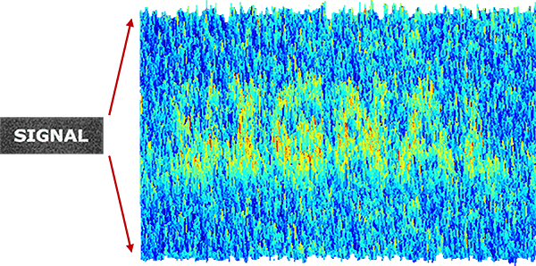

```{r setup, include=FALSE}
knitr::opts_chunk$set(echo = TRUE)
library(tidyverse)
library(here)
library(knitr)
library(kableExtra)
library(ggpubr)
```


# Today

* One mean versus the population (review)

* Two independent means

---

# One-sample *t*-test

The one-sample t-test is appropriate when a single sample mean is compared to a population mean but the population standard deviation is unknown.  

A sample estimate of the population standard deviation is used instead.  

The appropriate sampling distribution is the t-distribution, with N-1 degrees of freedom.

$$t_{df=N-1} = \frac{\bar{X}-\mu}{\frac{\hat{\sigma}}{\sqrt{N}}}$$
---

## A new example

We can again use the Census at School database, which includes six questions asking students to rate the following issues on a scale from 0 (not important) to 1000 (very important):

* Reducing pollution
* Recycling
* Conserving water
* Conserving energy (electricity, gas, oil for heating, lighting, car travel)
* Owning a computer
* Access to the internet

A random sample of 247 Oregon high schoolers can be compared to the means from high schoolers from all 50 states.


---

```{r, results = 'hide', warning = F, message = F}
school = read_csv(here("data/census_at_school.csv"))
school = school %>% filter(ClassGrade >= 9)

usa = read_csv(here("data/census_at_school_usa.csv"))
usa = usa %>% filter(ClassGrade >= 9 & Region != "OR")
```

---

The null and alternative hypotheses:

$$H_0: \bar{X}_{OR} = \mu_{USA}$$

$$H_1: \bar{X}_{OR} \neq \mu_{USA}$$

```{r, eval = F}
t.test(school$Importance_reducing_pollution, 
       mu = mean(usa$Importance_reducing_pollution, na.rm=T),
       alternative = "two.sided", conf.level = .95)
```

```{r, echo = F, results = 'asis'}
variables = names(usa)[grepl("Importance", names(usa))]
USA_means = usa %>%
  select(variables) %>%
  mutate_all(function(x) as.numeric(gsub("\\D+","",x))) %>%
  summarise_all(mean, na.rm=T)

school %>%
  select(variables) %>%
  mutate_all(function(x) as.numeric(gsub("\\D+","",x))) %>% 
  gather("variable", "scores") %>%
  nest(scores) %>%
  mutate(OR = map(data, function(x) mean(x$scores, na.rm=T))) %>%
  mutate(usa = t(USA_means)[,1]) %>%
  mutate(t = map2(data, usa, function(x,y) t.test(x$scores, mu = y))) %>%
  mutate(t.value = map(t, "statistic")) %>%
  mutate(t.value = map(t.value, 1)) %>%
  mutate(p.value = map(t, "p.value")) %>%
  select(variable, OR, usa, t.value, p.value) %>%
  unnest() %>%
  mutate(variable = gsub("Importance_", "", variable)) %>%
  kable(., digits = 2, col.names = c("Issue", "USA Mean", "OR mean", "t value", "p value")) %>%
  kable_styling()
```

---

.small[The lsr package has t-test functions that provide more detailed output.]

```{r}
lsr::oneSampleTTest(x = school$Importance_reducing_pollution, 
       mu = mean(usa$Importance_reducing_pollution, na.rm=T))
```

---

### Assumptions

* Normality
* Independence

If population scores are normally distributed, the sampling distribution of the mean will also be normally distributed.

If the data are independent, then the *t* distribution chosen by $df = N-1$ will provide an accurate approximation of the sampling distribution of the mean for purposes of making inferences.

---

## Independent samples *t*-test

The independent samples *t*-test is appropriate when the means from two independent samples are compared.

$$H_0: \mu_1 = \mu_2$$
$$H_1: \mu_1 \neq \mu_2$$

Test statistic is (roughly) defined by

$$t = \frac{\bar{X}_1 - \bar{X}_2}{SE}$$

The standard error of the mean difference can be estimated in two different ways.  If the variances for the two groups are the same, then pooling them provides the most powerful solution, known as Student’s t-test.  Otherwise, a separate-variances estimate is used, resulting in Welch’s t-test.

---

More formally, the numerator of the t-statistic is the following:

$$t = \frac{(\bar{X}_1 - \bar{X}_2)-(\mu_1 - \mu_2)}{SE}$$
In other words, is the difference between the sample means different from the hypothesized difference in the population means?

* $\bar{X}_1 - \bar{X}_2$ = our observed difference in (independent) means
* $\mu_1 - \mu_2$ = the (null) hypothesized difference in (independent) means

In this sense, the independent samples t-test is similar to a one-sample test of differences.

.pull-left[
$$H_0: \mu_1 - \mu_2 = 0$$
]

.pull-right[
$$H_1: \mu_1 - \mu_2 \neq 0$$
]

---

Calculating the demoninator of this test is not straightfoward. If we think of our test as a one-sample test of our difference score, then we need our standard error to be that of difference in means, not means themselves.

$\text{SE (difference in means)} = \sigma_D$

To take our standard error of the mean calculation and adjust it to reflect a difference in means, we make a small adjustment:

$$\sigma_D = \hat{\sigma}_p\sqrt{\frac{1}{N_1} + \frac{1}{N_2}}$$

---

A key assumption of the independent samples t-test is **homogeneity of variance,** meaning that even if these samples come from different populations, those populations differ only in terms of their mean, not in terms of their variance. 

The benefit of making this assumption is that we can calculate a single estimate of variance and simply adjust the units (as in the previous slide). 

If the variance in both samples is exactly the same, then we can plug $\hat{\sigma}$ in for $\sigma_p$ and be done.

---

### Pooled variance

Rarely do we find that the variance estimates are *exactly* the same, in which case, we need to combine the two estimates to get a single variance number. This is called the **pooled variance**.

$$\large{\hat{\sigma}^2_p = \frac{(N_1-1)\hat{\sigma}^2_1 + (N_2-1)\hat{\sigma}^2_2}{N_1+N_2-2}}$$
--

The bottom part, $N_1+N_2-2$ is the degrees of freedom for an independent sample *t*-test. The total number of quantities ( $N_1+N_2$ total scores) minus the number of constraints (2 means).

Each variance is weighted based on its sample's contribution to degrees of freedom. 

---

So our final calculation for the standard error of the difference of independent means is

$$\large{\hat{\sigma}_D = \sqrt{\frac{(N_1-1)\hat{\sigma}^2_1 + (N_2-1)\hat{\sigma}^2_2}{N_1+N_2-2}} \sqrt{\frac{1}{N_1} + \frac{1}{N_2}}}$$
**Recap**

The first part of this equation pools the two variance estimates by weighting each one based on sample size. 

The second part changes the units from scores to differences in means. 
  * Recall that in hypothesis testing, we're not interested in the likelihood of scores, but the likelihood of statistics. 
  
---

At this point, the procedure of hypothesis testing goes back to normal.

We have our sampling distribution under the null hypothesis, which is a *t* distribution defined by

$$
\begin{aligned}
 \mu &= 0 \\
 \sigma_D &= \sqrt{\frac{(N_1-1)\hat{\sigma}^2_1 + (N_2-1)\hat{\sigma}^2_2}{N_1+N_2-2}} \sqrt{\frac{1}{N_1} + \frac{1}{N_2}} \\
 df &= N_1 + N_2 - 2
\end{aligned}
$$
In this case, we're using $\sigma_D$ the same way we use $\sigma_M$, we just change the notation to reflect our interest in a difference in means, rather than the mean itself.

---

We calculate our test statistic

$$ t = \frac{\bar{X}_1-\bar{X}_2}{\sigma_D}$$
and then find the probability of this test statistic or more extreme under the null. 

---

## Example

We turn again to the Census at School data. One question that students were asked was to report how many hours per week they spent time with friends. We might be interested to know whether adolescent girls spend more time with friends than adolescent boys. 

```{r, echo = 4:5, message = F, warning = F}
school = read_csv(here("data/census_at_school.csv"))
school$friends = school$Hanging_Out_With_Friends_Hours
school = filter(school, !is.na(Gender))
table(school$Gender)
psych:: describe(school$Hanging_Out_With_Friends_Hours)
```

---
.pull-left[
```{r, message = F, warning = F}
school %>%
  ggplot(aes(x = friends)) + 
   geom_density(color = "red", size = 2, fill = "red", alpha = .3) + 
  geom_histogram(aes(y = ..density..), bins = 50) + 
 labs(x = "Hours per week", title = "Full sample") + theme_minimal(base_size = 20)
```
]

.pull-right[
```{r, message = F, warning = F}
school %>%
  filter(friends < 168) %>%
  ggplot(aes(x = friends)) + 
  geom_density(color = "red", size = 2, fill = "red", alpha = .3) + 
  geom_histogram(aes(y = ..density..), bins = 50) + 
  labs(x = "Hours per week", title = "Mathematically possible") + theme_minimal(base_size = 20)
```
]

---

Maybe I'll exclude participants who report impossible numbers.

```{r}
school_new = filter(school, friends < 168)
psych::describeBy(school_new$friends, group = school_new$Gender)
```

--
```{r, echo = F}
stats = psych::describeBy(school_new$friends, group = school_new$Gender)
```

.pull-left[
$$
\begin{aligned}
 \bar{X}_1 &= `r round(stats$Female[1, "mean"],2)` \\
 \hat{\sigma}_1 &= `r round(stats$Female[1, "sd"],2)` \\
 N_1 &= `r round(stats$Female[1, "n"])` \\
\end{aligned}
$$
]

.pull-right[
$$
\begin{aligned}
 \bar{X}_2 &= `r round(stats$Male[1, "mean"],2)` \\
 \hat{\sigma}_2 &= `r round(stats$Male[1, "sd"],2)` \\
 N_2 &= `r round(stats$Male[1, "n"])` \\
\end{aligned}
$$
]

---

```{r, echo = F}
x1 = stats$Female[1, "mean"]
s1 = stats$Female[1, "sd"]
n1 = stats$Female[1, "n"]

x2 = stats$Male[1, "mean"]
s2 = stats$Male[1, "sd"]
n2 = stats$Male[1, "n"]

rx1 = round(x1, 2)
rs1 = round(s1, 2)
rn1 = round(n1, 2)
rx2 = round(x2, 2)
rs2 = round(s2, 2)
rn2 = round(n2, 2)

s=sqrt(((n1-1)*s1^2+(n2-1)*s2^2)/(n1+n2-2))

s_d = s*sqrt((1/n1) + (1/n2))

df = n1+n2-2
```


Next we build the sampling distribution under the null hypotheses.

$$
\begin{aligned}
 \mu &= 0 \\
 \\
 \sigma_D &= \sqrt{\frac{(`r rn1`-1){`r rs1`}^2 + (`r rn2`-1){`r rs2`}^2}{`r rn1`+`r rn2`-2}} \sqrt{\frac{1}{`r rn1`} + \frac{1}{`r rn2`}}\\
 &= `r round(s,2)`\sqrt{\frac{1}{`r rn1`} + \frac{1}{`r rn2`}} = `r round(s_d,2)`\\
 \\
 df &= `r n1+n2-2`
\end{aligned}
$$ 
---

```{r, echo = 1}
(cv = qt(p = .975, df = 203))
  
x = c(-5:5)

data.frame(x) %>%
  ggplot(aes(x=x)) +
  stat_function(fun= function(x) dt(x, df = df), geom = "area", 
                xlim = c(cv, 5), fill = "purple") +
  stat_function(fun= function(x) dt(x, df = df), geom = "area", 
                xlim = c(-5, cv*-1), fill = "purple") +
  stat_function(fun= function(x) dt(x, df = df), geom = "line") +
  labs(x = "Difference in means", y = "density") +
  theme_light(base_size = 20)

```


---

.left-column[We calculate our test statistic and compare that to our critical value.]

```{r}
(t = (x1-x2)/s_d)
```

```{r, echo = F}

data.frame(x) %>%
  ggplot(aes(x=x)) +
  stat_function(fun= function(x) dt(x, df = df), geom = "area", 
                xlim = c(cv, 5), fill = "purple") +
  stat_function(fun= function(x) dt(x, df = df), geom = "area", 
                xlim = c(-5, cv*-1), fill = "purple") +
  stat_function(fun= function(x) dt(x, df = df), geom = "line") +
  geom_vline(aes(xintercept = t), color = "black")+
  labs(x = "Difference in means", y = "density") +
  theme_light(base_size = 20)

```

---

.left-column[
We can also calculate the probability of this test statistic or more extreme under the null.

```{r}
pt(t, 
   df = df, 
   lower.tail = 
     F)*2
```

]

```{r, echo = F}

data.frame(x) %>%
  ggplot(aes(x=x)) +
  stat_function(fun= function(x) dt(x, df = df), geom = "area", 
                xlim = c(t, 5), fill = "purple") +
  stat_function(fun= function(x) dt(x, df = df), geom = "area", 
                xlim = c(-5, t*-1), fill = "purple") +
  stat_function(fun= function(x) dt(x, df = df), geom = "line") +
  geom_vline(aes(xintercept = cv), color = "black")+
  labs(x = "Difference in means", y = "density") +
  theme_light(base_size = 20)

```

---

Alternatively, we can not do any of that, and use an R function.

```{r}
t.test(friends~Gender, data = school_new, var.equal = T)
```


---

## Confidence intervals

**Confidence intervals** are used to communicate the precision in our how well our statistic estimates the parameter. As a reminder, they are grounded in frequenst probability: if we repeated our experiment many times, we would expect that 95% of the time, our 95% confidence interval would capture the true population parameter.

In an independent sample's t-test, you have calculated three different statistics, and so you can construct three different confidence intervals.

---

### Confidence interval around the difference in means

The most interpretable statistic is the difference in means -- this is the statistic you are testing using NHST. 

$$CI_{\text{Difference}} = (\bar{X}_1 - \bar{X}_2) \pm \sigma_D(CV)$$

.pull-left[
Your critical value (CV) is determined by your degrees of freedom and alpha. 

In our example, we used $\alpha = .05$ and our df = $122+83-2 = 203$.

```{r}
qt(p = .975, df = 203)
```
]
--

.pull-right[

$$CI_{\text{Difference}} = \\(18.31 -12.34) \pm 2.76(1.97)$$
$$[0.53, 11.41]$$

]

---

### Confidence intervals around estimates of the mean

In addition to calculating precision of the estimate in difference in means, you may also want to calculate the precision of the mean estimates themselves. 

In this case, you should use the standard deviation of the group sample as your estimate of population sd, instead of merging them. 

$$
\begin{aligned}
CI_{\text{Mean}} &= {X} \pm \sigma_M(CV) \\
 &= {X} \pm \frac{\hat{\sigma}}{\sqrt{N}}(CV)
\end{aligned}
$$
---

$$
\begin{aligned}
 &= {X} \pm \frac{\hat{\sigma}}{\sqrt{N}}(CV)
\end{aligned}
$$
.pull-left[
**Females**

```{r}
sd(school_new$friends[school_new$Gender == "Female"], na.rm=T)
qt(.975, df = 122-1)
```


$$18.31 \pm \frac{21.44}{\sqrt{122}}(1.98)$$
$$[14.47, 22.15]$$
]

.pull-right[
**Males**

```{r}
sd(school_new$friends[school_new$Gender == "Male"], na.rm=T)
qt(.975, df = 83-1)
```


$$12.34 \pm \frac{15.91}{\sqrt{83}}(1.99)$$
$$[8.87, 15.81]$$
]

---

```{r message = F, warning = F}
library(ggpubr)
ggerrorplot(school_new, x = "Gender", y = "friends", 
            desc_stat = "mean_ci", color = "Gender", 
            ylab = "Hours spent with friends (per week)")
```
---


```{r message = F, warning = F}
ggerrorplot(school_new, x = "Gender", y = "friends", 
            desc_stat = "mean_ci", color = "Gender", 
            ylim=range(school_new$friends, na.rm=T),
            ylab = "Hours spent with friends (per week)")
```
---

### What is a test statistic?

.pull-left[

$$Z = \frac{\bar{X}-\mu}{\sigma_M}$$

$$t = \frac{\bar{X}-\mu}{\frac{s}{\sqrt{N}}}$$
]

.pull-right[

$$t = \frac{(\bar{X}_1 - \bar{X}_2)-(\mu_1 - \mu_2)}{\sqrt{\frac{(N_1-1)\hat{\sigma}^2_1 + (N_2-1)\hat{\sigma}^2_2}{N_1+N_2-2}} \sqrt{\frac{1}{N_1} + \frac{1}{N_2}}}$$

]

All test statistics measure 

$$\frac{\text{Signal}}{\text{Noise}}$$

---

class: center


---

class: inverse

## Next time

* Assumptions
* Cohen's D 
* Matrix algebra


