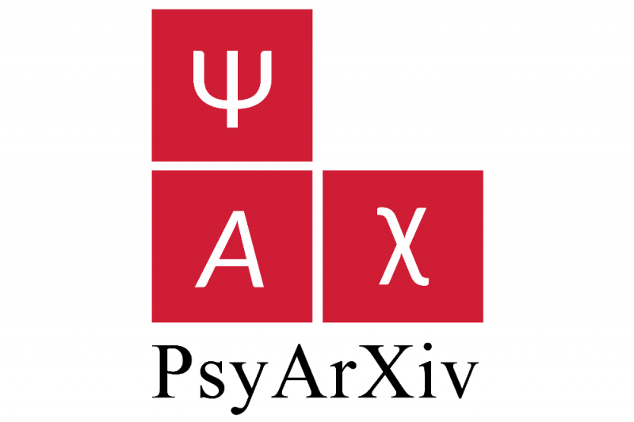
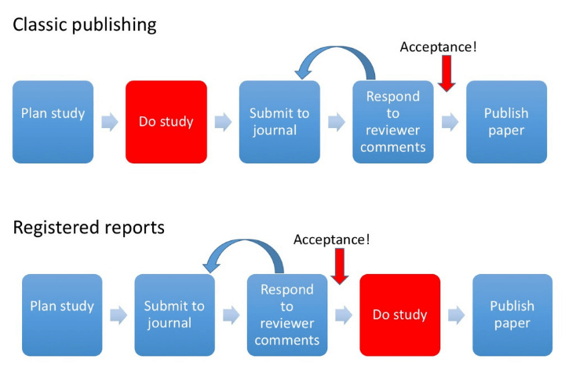
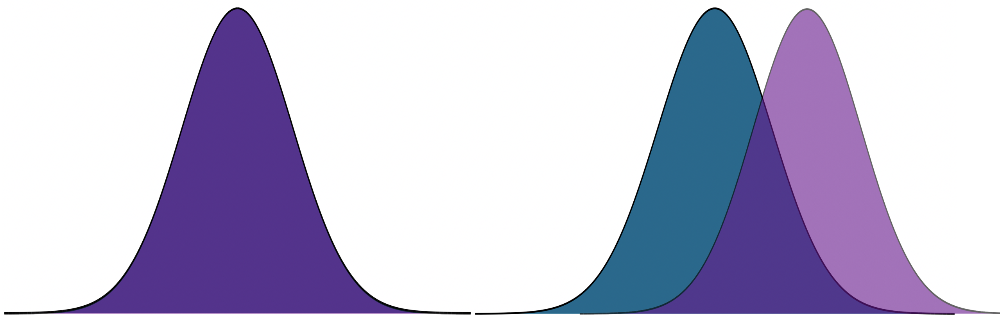

```{r setup, include=FALSE}
knitr::opts_chunk$set(echo = TRUE)
library(here)
library(tidyverse)
library(papaja)
library(ggpubr)
library(fivethirtyeight)
library(knitr)
library(kableExtra)
```

  
## Last time...

* Effect sizes and assumptions of _t_-tests

  * Cohen's D
  * Overlap of population distributions
  
  * Independence
  * Homogeneity of variance
  * Normality
  
---

## Example

In the country of Panem, there are 13 (or 14?) distinct geographic districts, each of which specializes in a particular trade or industry. The Capital is the most technologically advanced and is home to wealthy elites (CEOs, politicians, university professors, etc). District 12 is a coal-mining district. 

Researchers asked whether these two geographic regions differ in their exposure to daily life stress. Citizens of these districts were randomly sampled and completed the [Survey of Recent Life Experiences](https://link.springer.com/article/10.1007/BF00848327), which measures daily hassles. Scores can range from 0 (no daily hassles) to 160 (constant daily hassles).

What are the null and alternative hypotheses? What kind of test will we run?

---

| Capital | District 12 |
|:-------:|:-----------:|
| 12      | 100         |
| 72      | 92         |
| 81      | 110         |
| 69      | 99         |
| 44      | 80         |
| 61      | 96         |
| 55      | 102         |
| 43      | 98         |
| 60      | 71         |
| 52      | 86         |

---
```{r}
panem = data.frame(
  district = rep(c("Capital", "12"), each = 10),
  srle = c(
    12,72,81,69,44,61,55,43,60,52,
    100,92,110,99,80,96,102,98,71,86)
)

psych::describeBy(panem$srle, group = panem$district, fast = T)
```

```{r, echo = F, messsrle = F, warning = F, results ='hide'}
sum_stats = panem %>%
  group_by(district) %>%
  summarize(
    n = n(),
    m = mean(srle),
    sd = sd(srle)
  )
```

---
.pull-left[
**Capital**  
$N = `r printnum(sum_stats$n[1])`$  
$M = `r printnum(sum_stats$m[1])`$  
$SD = `r printnum(sum_stats$sd[1])`$]

.pull-right[
**District 12**  
$N = `r printnum(sum_stats$n[2])`$  
$M = `r printnum(sum_stats$m[2])`$  
$SD = `r printnum(sum_stats$sd[2])`$]

* Set an alpha-level. 

* Define sampling distribution. 

$$\mu_D = \mu_0$$
$$\sigma_D = ??$$
--

The standard error of the difference in means is the $\frac{\text{population standard deviation}}{\sqrt{N}}$.

But we have two sample sizes, and we have two estimates of the population SD.

---

```{r, echo = F}
pool_var = ((9*sum_stats$sd[1]^2) + (9*sum_stats$sd[2]^2))/(18)
pool_sd = sqrt(pool_var)
```


Calculate pooled variance (to get our best estimate of the population variance):

$$\large{\hat{\sigma}^2_p = \frac{(N_1-1)\hat{\sigma}^2_1 + (N_2-1)\hat{\sigma}^2_2}{N_1+N_2-2}}$$
$$\large{\hat{\sigma}^2_p = \frac{(10-1)`r printnum(sum_stats$sd[1])`^2 + (10-1)`r printnum(sum_stats$sd[2])`^2}{10+10-2}} = `r printnum(pool_var)`$$
Don't forget to take the square root to get our SD estimate.

$$\large{\hat{\sigma}_p = \sqrt{\hat{\sigma}^2_p} = \sqrt{`r printnum(pool_var)`} = `r printnum(sqrt(pool_var))`} $$

---

```{r, echo = F}
se = sqrt(pool_var)*sqrt((1/10) + (1/10))
```


Deal with two sample sizes by weighting by $\sqrt{\frac{1}{N_1} + \frac{1}{N_2}}$ instead of $\frac{1}{\sqrt{N}}$.

$$\sigma_D = \sigma_p\sqrt{\frac{1}{N_1} + \frac{1}{N_2}} = `r printnum(sqrt(pool_var))`\sqrt{\frac{1}{10} + \frac{1}{10}} = `r printnum(se)`$$

```{r, echo = F}
t = (sum_stats$m[1] - sum_stats$m[2])/se
```

Calculate our _t_-statistic:

$$t = \frac{(\bar{X}_1 - \bar{X}_2) - (\mu_1 - \mu_2)}{\sigma_D} = \frac{`r printnum(sum_stats$m[1])` - `r printnum(sum_stats$m[2])` - 0}{`r printnum(se)`} = `r printnum(t)`$$
---

```{r}
t.test(srle~district, data = panem, var.equal = T)
```

---

```{r, echo = F}
cohend = (sum_stats$m[1] - sum_stats$m[2])/sqrt(pool_var)
```

Is this a large difference? 

$d = \frac{\bar{X}_1 - \bar{X}_2}{\sigma_p} = \frac{`r printnum(sum_stats$m[1])` - `r printnum(sum_stats$m[2])` - 0}{`r printnum(sqrt(pool_var))`} = `r printnum(cohend)`$

```{r}
(cohensd = lsr::cohensD(srle~district, data = panem, method = "pooled"))
```

---

How much power did we have to detect this effect?

```{r, echo = F}
mu = 0
s = sqrt(pool_var)
sem = se

mean = sum_stats$m[1] - sum_stats$m[2]

cv = qnorm(mean = mu, sd = se, p = .025, lower.tail = F)


ggplot(data.frame(x = seq(-20, 60)), aes(x)) +
  stat_function(fun = function(x) dnorm(x, m = mu, sd = sem)) +
  
  stat_function(fun = function(x) dnorm(x, m = mean, sd = sem),
                geom = "area", xlim = c(cv, 60), 
                aes(fill = "Power"), alpha = .5) +
  stat_function(fun = function(x) dnorm(x, m = mean, sd = sem),
                geom = "area", xlim = c(-20, cv), 
                aes(fill = "Type II Error"), alpha = .5) +
  stat_function(fun = function(x) dnorm(x, m = mu, sd = sem),
                geom = "area", xlim = c(cv, 60), 
                aes(fill = "Type I Error"), alpha = .5) +
  stat_function(fun = function(x) dnorm(x, m = mean, sd = sem)) +
  geom_vline(aes(xintercept = mu))+
  geom_vline(aes(xintercept = mean))+
  geom_hline(aes(yintercept = 0))+
  scale_x_continuous("Difference in means", breaks = seq(-20,60,10)) +
  scale_y_continuous(NULL, breaks = NULL) + 
  theme_pubr() +
  theme( text = element_text(size = 20),
    legend.position = "bottom")
```

---

We can calculate this by hand: remember, this is the area under our alternative distribution that is from the critical value and farther away from our mean.

```{r}
(critical_value = qnorm(mean = 0, 
                        sd = 7.098, 
                        p = .025, 
                        lower.tail = F))
pnorm(q = critical_value, 
      mean = 38.5, 
      sd = 7.098, 
      lower.tail = F)
```

---

But you don't need to do things by hand:

```{r}
library(pwr)
pwr.t.test(n = 10, 
           d = cohensd, 
           sig.level = .05, 
           type = "two")
```

The arguments for the `pwr.t.test` function are sample size (`n`), effect size (`d`), alpha level (`sig.level`), and power (`power`). Give it any three, and it will return the fourth!

---


This is very useful. For example, if we wanted to replicate this study, how many participants would we need? We can use the same function to find out:

```{r}
pwr.t.test(
  d = cohensd,
  sig.level = .05, 
  power = .90, 
  type = "two"
)
```

---

Did we meet the assumptions of this test?

--

```{r, warning = F}
car::leveneTest(srle~district, data = panem, center = "mean")
```

--

```{r, echo = 1, fig.height = 2, fig.width=8}
shapiro.test(x = panem$srle)
panem %>% ggplot(aes(x = srle)) + geom_histogram(bins = 5, fill = "purple", color = "white") + theme_pubr()
```


---

Hold up: how often is it really the case that the population variances are the same (homogeneity of variance)?

For an independent-samples _t_-test, it's trivially easy to bypass the homogeneity of variance assumption and use a Welch's _t_-test instead. There's a loss of power, but for sample sizes used today, it's not so bad.

```{r}
t.test(srle~district, data = panem)
```

**However**, this is not the last you'll see of this assumption, and relaxing this assumption will become more difficult.

---

## Today...

The open science movement (re:statistics)

- Advancements in programming help researchers identify statistical problems
- A push for new metrics in psychology research
- Attempts to quantify the state of the field
- Development of new research practices to reinvest in old statistics
- Development analytic techniques

---
  
## Open Science Movement

Sometimes labelled **"the reform movement"** -- (psychological) scientists trying to address problems in the field identified as part of the replication crisis. 

(Note, these are not distinct periods of history, nor are either of them considered over.)

**Open** because one of the primary problems of the replication crisis was the lack of transparency. Stapel, Bem, everyone did work in private; kept data secret; buried, hid, lost key aspects of research. Opaque was normal.

See [Kathawalla et al. (2020)](../readings/Kathawalla_2020.pdf) for a great tutorial for grad students!
  

---
## 1. We identify problems


New methods of conducting science on science (meta-science) -- often developed to find fraud, but super useful for detecting errors

* [Granularity-related inconsistency of means (GRIM)](http://www.prepubmed.org/grim_test/) test -- is the mean mathematically possible given the sample size?

* [Sample Parameter Reconstruction via Iterative TEchniques (SPRITE)](https://hackernoon.com/introducing-sprite-and-the-case-of-the-carthorse-child-58683c2bfeb) -- given a set of parameters and constraints, [generate](https://steamtraen.shinyapps.io/rsprite/) lots of possible samples and examine for common sense. 

* [StatCheck](http://statcheck.io/) -- upload pdfs and word documents to look for inconsistencies (e.g., statistic, df)

---
## 1. We identify problems

Conceptually, psychologists have struggled with the [interpretation of p-values](https://fivethirtyeight.com/features/not-even-scientists-can-easily-explain-p-values/).

Even worse, we seemed to forget some of the most basic assumptions of our statistical tests. 

- What must be true about our trials to use a binomial distribution?
.small[Remember p-curve?]

---

## 2. A push for "new" metrics in psychology research (2014)

 Disillusionment with _p_-values led many to propose radical changes.
 
 But the field is ruled by researchers who made their name using NHST (and very likely, many of them also used these fishing-methods to build their careers). So a softer approach was more widely favored.
 
 [Cumming (2014)](../readings/Cumming_2014.pdf) proposes the "new statistics" which emphasize effect sizes, confidence intervals, and meta-analyses. 

---

Except...

Confidence intervals are based on the same underlying probability distributions as our p-values. 

And what's the problem with meta-analyses?

---

## 3. Attempts to quantify the state of the field 

[The Reproducibility Project (2015) ](https://www.theatlantic.com/science/archive/2015/08/psychology-studies-reliability-reproducability-nosek/402466/) finds that most findings in psychological science don't replicate. 

Also, [new methods](../readings/Meta-analyses-are-f.pdf) for approaching meta-analyses are studied and popularized. 
- There is a growing realization that meta-analyses cannot fix the problem -- publication bias (and p-hacking) have polluted the waters. 

---

# Some more drastic changes

## 4. New(ish) research practices 

- New(ish) tools for improving reproducibility
- New(ish) tools for reducing the file drawer problem 
- New(ish) tools for limiting _p_-hacking
- New(ish) tools for limiting publication bias

---

### Developing data norms (not new)

- A _major_ challenge to both reproducibility and robust science is how opaque other peoples' data and analyses are. 

 - Fix by having standards and developing methods for communicating details.

- Brain Imaging Data Structure (new!) **([BIDS](https://bids.neuroimaging.io/))**

- [codebook](https://cran.r-project.org/web/packages/codebook/index.html) R package

---

### Open Science Framework (OSF.io)

* Repository, also includes version control
  * Reproducibility
  * Git (Github) is also a great repository for similar reasons!

* Doesn't use code/terminal to update files
  * Drag and drop, or linked with other repository (Dropbox, Box, Google Drive, etc)
  
* Also great for collaborations

* "Easy" to navigate

* Can be paired with applications you already use

---
### Reducing file drawer: PsyArXiv

.pull-left[

]

* preprint = the pre-copyedited version of your manuscript

* journals have different policies regarding what you can post. It's always a good idea to [check](http://sherpa.ac.uk/romeo/index.php).

---

### Preregistration

OSF also allows you to preregister a project. 

**[Preregistration](https://www.theguardian.com/science/blog/2013/jun/05/trust-in-science-study-pre-registration)** is creating a time-stamped, publicly available, frozen document of your research plan prior to executing that plan. 


---

### Limit p-hacking: Preregistration


#### Goal: Make it harder to p-hack and HARK
  * Did the researcher preregister 3 outcome variables and only report one? 
  * Did the researcher *actually* believe this correlation would be significant?
  
--
  
#### Goal: distinguish data-driven choices from theory based choices
  * Was the covariate included because of theory or based on descriptive statistics?
  
--

#### Goal: correctly identify confirmatory and exploratory research
  * Exploratory research should be OK!
  * Protection against editors and reviewers


---

### Preregistration

**What goes in a preregistration?** Any decisions you feel comfortable making before you see the data. 

- [Analyses or predictions](.../readings/ledgerwood.pdf)?

- [See here for experimental guidelines](.../readings/vantveer_2016.pdf)
- [See here for secondary data analysis](.../readings/vandenakker_2021.pdf)
- [See here for ESM data](.../readings/kirtley_2021.pdf)
- [See here for fMRI studies](https://www.psycharchives.org/handle/20.500.12034/4544)

---

### Registered reports

**Registered reports (RR)** are a special kind of journal article

```{r, echo = F, out.width='80%'}

```

.small[image credit: [Doropthy Bishop](https://blog.wellcomeopenresearch.org/2018/12/04/rewarding-best-practice-with-registered-reports/)]


---
## 5. Development of new(ish) analytic techniques

**Sensitivity analyses** and [**multiverse analyses**](https://www.psychologicalscience.org/observer/run-all-the-models-dealing-with-data-analytic-flexibility) test the robustness of a finding. These often including testing every possible set of covariates or subgroups, to see whether a particular finding is just because of a unique combination of variables and people. 

---

## Criticisms

Certainly there are some who argue that open science methods are broadly harmful: stifle creativity, slow down research, incentivize *ad hominem* attacks and "methodological terrorists", and encourage "data parasites." 

It is worth admitting that, unless incentive structures don't change, there can be harm done with adoption of these methods. But part of the goal is to change the overall system.

--

A more legitimate criticism is that adoption of these methods can fool researchers into believing that all research using these methods is "good" and all research not using them are "bad."

["Preregistration is redundant, at best." (Oct 31, 2019). Szollosi et al.](https://psyarxiv.com/x36pz/)

--

And it's worth adding that this kind of work can take longer.

---

class: inverse

## Wrap up and a look ahead

---

Most statistical methods propose some model, represented by linear combinations, and then tests how likely we would be to see data like ours under that model. 

* one-sample *t*-tests propose that a single value represents all the data

* *t*-tests propose a model that two means differ 

* more complicated models propose that some combination of variables, categorical and continuous, govern the patterns in the data

--

As we think about where we're going next term, it will be helpful to put some perspective on what we've covered already.

---

background-image: url("images/wrap-up1.jpeg")
background-size: contain

---

background-image: url("images/wrap-up2.jpeg")
background-size: contain

---

background-image: url("images/wrap-up3.jpeg")
background-size: contain

---

background-image: url("images/wrap-up4.jpeg")
background-size: contain

---

background-image: url("images/wrap-up5.jpeg")
background-size: contain

---

background-image: url("images/wrap-up6.jpeg")
background-size: contain

---

Because we're using probability theory, we have to assume independence between trials.

* independent rolls of the die
* independent draws from a deck of cards
* independent... tests of hypotheses?


What happens when our tests are not independent of one another?

* For example, what happens if I only add a covariate to a model if the original covariate-less model is not significant?

* Similarly, what happens if I run multiple tests on one dataset?

---

The issue of independence between tests has long been ignored by scientists. It was only when we were confronted with impossible-to believe results (people have ESP, listening to "When I'm Sixty-Four" by The Beatles makes you younger) that we started to doubt our methods.

And an explosion of fraud cases made us revisit our incentive structures. Maybe we weren't producing the best science we could...

.pull-left[

]

.pull-right[

Since then (2011), there's been greater push to revisit "known" effects in psychology and related fields, with sobering results. 

The good news is that things seem to be changing, rapidly.
]

---

Independence isn't the only assumption we have to make to conduct hypothesis tests. 

We also make assumptions about the underlying populations.


.pull-left[Normality]
.pull-right[Homogeneity of variance]

&nbsp;&nbsp;
Sometimes we fail to meet those assumptions, in which case we may have to change course. 


.small[Picture credit: Cameron Kay]

---

How big of a violation of the assumption is too much?

--

* It depends. 


How do you know your operation X measures your construct A well?

--

* You don't. 

What should alpha be?

--

* You tell me. 


---

.pull-left[
Statistics is not a recipe book. It's a tool box. And there are many ways to use your tools.

Your job is to 
1. Understand the tools well enough to know how and when to use them, and
2. Be able to justify your methods.

]

.pull-right[

]

It's worth adding to that, as a graduate student, you're long past the days of trying to memorize and regurgitate information in a class. You're training to be an independent scholar. For that reason, we've focused on helping you figure things out for yourself, which will be a far more useful skill than learning less material more deeply now. 

Teach a scientist to fish, or something like that.
---

class: inverse

## Next time...

PSY 612 in 2022

(But first):
* Quiz 9 now 
* Journal 10 due Monday night
* Oral exams next week
* Homework 3 due Wednesday (9am)
* All revisions due Friday (5pm)


